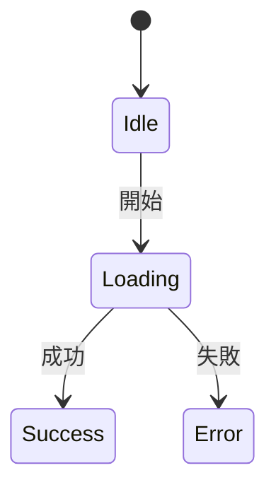
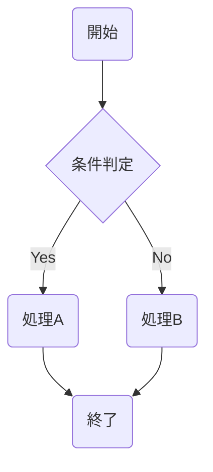

## Directory Structure Overview

| Directory | Role | Examples |
|-----------|------|---------|
| `docs/spec/` | Product specs (persistent) | Feature specs, screen specs, API specs |
| `docs/workflows/` | Workflow work folder (**temporary, .gitignore**) | Research, design drafts, test design |
| `docs/architecture/` | System design | ADR, overview, diagrams |
| `docs/security/` | Security | Threat models |
| `docs/testing/` | Testing | Test plans, reports |
| `docs/operations/` | Operations | Runbooks, deploy config |

## docs/ Directory Tree (compressed)

```
docs/
├── glossary.md
├── guides/
├── product/
│   ├── features/        # Feature specs (module unit) ★IMPORTANT
│   ├── screens/
│   ├── api/
│   ├── events/
│   ├── database/
│   ├── messages/
│   ├── user-stories/
│   ├── personas/
│   ├── journeys/
│   ├── sitemap.md
│   ├── seo/
│   ├── i18n/
│   ├── design-system/
│   ├── components/
│   ├── interactions/
│   ├── responsive/
│   ├── accessibility/
│   ├── wireframes/
│   └── diagrams/        # *.state-machine.mmd, *.flowchart.mmd
├── architecture/
│   ├── overview.md
│   ├── decisions/       # ADR: NNNN-title.md
│   ├── modules/
│   ├── integrations/
│   ├── batch/
│   └── diagrams/
├── security/threat-models/
├── testing/
│   ├── plans/
│   └── reports/
├── operations/
│   ├── runbooks/
│   ├── deployment/
│   ├── environments/
│   └── monitoring/
└── workflows/           # Temporary work artifacts
    └── {taskName}/
        ├── research.md, requirements.md, spec.md
        ├── threat-model.md, state-machine.mmd
        ├── flowchart.mmd, ui-design.md, test-design.md
```

## docs/spec/features/ Importance

**Feature specs (features/) are the core documents of the system.**

Each module/class must describe: responsibility and purpose, interface definitions, state transitions, edge cases, dependencies.

## Product Spec Reflection Rules

Manually place workflow artifacts into `docs/spec/` for persistence:
- Feature spec → `docs/spec/features/{name}.md`
- Screen spec → `docs/spec/screens/{name}.md`
- API spec → `docs/spec/api/{name}.md`
- Diagrams → `docs/spec/diagrams/{name}.mmd`

## Scope Setting Guidance

Set scope in research or requirements phase using `workflow_set_scope`.

- Without scope, test_impl phase may be skipped
- Include test files in scope so TDD cycle works correctly
- Include source code directories of implementation targets

```
workflow_set_scope({
  files: ["src/phases/definitions.ts"],
  dirs: ["src/"],
  glob: "src/**/*.ts"
})
```

## Artifact Placement Rules

Auto-created on workflow start:
- `workflowDir`: `.claude/state/workflows/{taskId}_{taskName}/` — internal state
- `docsDir`: `docs/workflows/{taskName}/` — work artifacts (override via `DOCS_DIR`)

**Important**: `docs/workflows/` is temporary — `.gitignore`'d, deleted after task completion.
Never use `docs/workflows/` in `@spec` comments; use persistent paths instead.

## Naming Conventions

File names use the target name (not the task name). All kebab-case.

| Category | Rule | Example |
|----------|------|---------|
| Feature spec | feature-name | `user-authentication.md` |
| Screen spec | screen-name | `login-screen.md` |
| API spec | api-name | `users-api.md` |
| DB design | table-name | `users.md` |
| Module design | module-name | `payment-service.md` |
| Diagram | target.type.mmd | `order.state-machine.mmd` |
| Threat model | project/feature-name | `payment-system.md` |
| Test plan | project/feature-name | `checkout-flow.md` |
| Test report | project-date | `checkout-20260118.md` |
| ADR | NNN-title | `0001-use-postgresql.md` |
| User story | feature-name | `checkout.md` |
| Component spec | component-name | `button.md` |
| Journey | persona-journey | `power-user-purchase.md` |

## diagrams Directory Usage

| Directory | Purpose | Examples |
|-----------|---------|---------|
| `docs/architecture/diagrams/` | System-wide structure | Infra, deploy, service mesh |
| `docs/spec/diagrams/` | Product feature design | State machines, flowcharts, screen transitions |

## Workflow Artifacts Example

```
docs/workflows/{taskName}/
├── research.md, requirements.md, spec.md
├── threat-model.md
├── state-machine.mmd, flowchart.mmd
├── ui-design.md, test-design.md
```

## Enterprise Placement Example

```
docs/
├── product/
│   ├── features/{name}.md        # ← created in requirements
│   ├── screens/{name}.md         # ← created in ui_design
│   └── diagrams/
│       ├── {target}.state-machine.mmd  # ← state_machine
│       └── {target}.flowchart.mmd      # ← flowchart
├── security/threat-models/{name}.md    # ← threat_modeling
└── testing/plans/{name}.md             # ← test_design
```

## Environment Variables

| Variable | Description |
|----------|-------------|
| `DOCS_BASE` | Docs base dir (default: `docs/`) |
| `DOCS_DIR` | Workflow artifacts dir (default: `docs/workflows/`) |
| `STATE_DIR` | Internal state dir (default: `.claude/state/`) |
| `VALIDATE_DESIGN_STRICT=false` | Warning mode for design validation |

## Mermaid Diagram Patterns

State machine (UI/state management) — use `stateDiagram-v2`:



Flowchart (business logic) — use `flowchart`:


