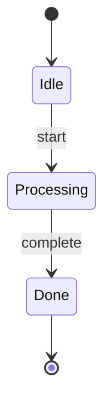

# 設計-実装整合性の自動検証機能 テスト設計

## 1. ユニットテスト

### UT-1: SpecParser

| ID | テストケース | 入力 | 期待結果 |
|----|------------|------|----------|
| UT-1.1 | クラス抽出 | `class Foo:` を含むmd | `{ classes: ['Foo'] }` |
| UT-1.2 | メソッド抽出 | `def bar()` を含むmd | `{ methods: ['bar'] }` |
| UT-1.3 | ファイルパス抽出 | `src/foo.ts` を含むmd | `{ filePaths: ['src/foo.ts'] }` |
| UT-1.4 | 空ファイル | 空文字列 | `{ classes: [], methods: [], filePaths: [] }` |

### UT-2: MermaidParser (StateMachine)

| ID | テストケース | 入力 | 期待結果 |
|----|------------|------|----------|
| UT-2.1 | 状態抽出 | `A --> B` | `{ states: ['A', 'B'] }` |
| UT-2.2 | 遷移抽出 | `A --> B: trigger` | `{ transitions: [{from:'A', to:'B', trigger:'trigger'}] }` |
| UT-2.3 | 開始状態 | `[*] --> A` | `{ hasStart: true }` |
| UT-2.4 | 終了状態 | `A --> [*]` | `{ hasEnd: true }` |

### UT-3: MermaidParser (Flowchart)

| ID | テストケース | 入力 | 期待結果 |
|----|------------|------|----------|
| UT-3.1 | プロセス抽出 | `A[Process]` | `{ processes: [{id:'A', label:'Process'}] }` |
| UT-3.2 | 決定点抽出 | `B{Decision?}` | `{ decisions: [{id:'B', label:'Decision?'}] }` |
| UT-3.3 | サブグラフ抽出 | `subgraph X ... end` | `{ subgraphs: ['X'] }` |

### UT-4: RequirementsParser

| ID | テストケース | 入力 | 期待結果 |
|----|------------|------|----------|
| UT-4.1 | FR抽出 | `FR-1.1` を含むmd | `{ functional: [{id:'FR-1.1'}] }` |
| UT-4.2 | NFR抽出 | `NFR-2.1` を含むmd | `{ nonFunctional: [{id:'NFR-2.1'}] }` |
| UT-4.3 | AC抽出 | `- [ ] 条件` を含むmd | `{ acceptance: [{checked:false, text:'条件'}] }` |
| UT-4.4 | ACチェック済み | `- [x] 条件` を含むmd | `{ acceptance: [{checked:true, text:'条件'}] }` |

### UT-5: DesignValidator

| ID | テストケース | 入力 | 期待結果 |
|----|------------|------|----------|
| UT-5.1 | 全項目実装済み | 全ファイル存在 | `{ passed: true }` |
| UT-5.2 | 一部未実装 | 一部ファイル欠損 | `{ passed: false, missingItems: [...] }` |
| UT-5.3 | 設計書なし | 空ディレクトリ | `{ passed: false, warnings: ['設計書なし'] }` |

## 2. 統合テスト

### IT-1: workflow_next統合

| ID | テストケース | 条件 | 期待結果 |
|----|------------|------|----------|
| IT-1.1 | 検証パス | 全設計項目実装済み | フェーズ遷移成功 |
| IT-1.2 | 検証失敗（厳格） | 未実装あり + STRICT=true | フェーズ遷移ブロック |
| IT-1.3 | 検証失敗（警告） | 未実装あり + STRICT=false | 警告出力 + 遷移成功 |
| IT-1.4 | 検証スキップ | SKIP_VALIDATION=true | 遷移成功 |

## 3. テストデータ

### 正常系spec.md

```markdown
## クラス設計

### DesignValidator

**ファイル**: `src/validation/design-validator.ts`

\`\`\`typescript
class DesignValidator {
    validateAll(): ValidationResult;
    parseSpec(): SpecItems;
}
\`\`\`
```

### 正常系state-machine.mmd



## 4. モック戦略

```typescript
// ファイルシステムモック
jest.mock('fs', () => ({
    existsSync: jest.fn(),
    readFileSync: jest.fn(),
}));

// stateManagerモック
const mockStateManager = {
    getTask: jest.fn(),
    updateTaskPhase: jest.fn(),
};
```
