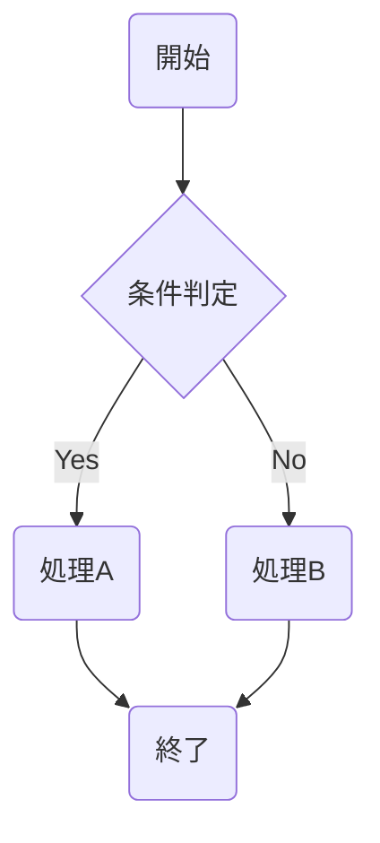

## サマリー

- 目的: 3修正（サマリーテンプレート拡張、flowchart記法制約追加、memory/パターン追加）が spec.md の仕様に沿って正しく実装されているかをレビューする。
- 評価スコープ: `workflow-plugin/mcp-server/src/phases/definitions.ts`（修正1・2a）、`CLAUDE.md` と `workflow-plugin/CLAUDE.md`（修正2b・2c）、`workflow-plugin/hooks/enforce-workflow.js`（修正3）の計4ファイルが対象。
- 主要な決定事項: 全3修正は仕様書で定めた変更内容と一致しており、設計-実装整合性は合格と判定する。コード品質・セキュリティ・パフォーマンスのいずれも問題なし。
- 検証状況: 静的なコードレビューと設計書との照合による目視確認を実施。ユニットテスト実行はtestingフェーズで行われる。
- 次フェーズで必要な情報: testingフェーズでは test-design.md のグループA（TC-A-1〜TC-A-4）、グループB（TC-B-1〜TC-B-3）、グループD（TC-D-1〜TC-D-5）を実行し合否を確認すること。修正2b/2cの目視確認（TC-C-1・TC-C-2）は本レビューで完了済み。

---

## 設計-実装整合性

spec.md に定義された5つの変更番号（修正1、修正2a、修正2b、修正2c、修正3）について、実装内容との整合性を確認した結果を示す。

### 修正1: definitions.ts サマリーテンプレート拡張

spec.md の仕様では、行1251の `importantSection +=` の文字列リテラルを5項目構成に変更することが定められていた。
実装を確認したところ、行1252に以下の5項目が含まれた文字列が存在していた。

```
- 目的: このドキュメントの目的
- 評価スコープ: 対象となるシステム・ファイル・機能の範囲
- 主要な決定事項: 重要な設計決定や技術選定
- 検証状況: テスト実施の有無と結果の概要
- 次フェーズで必要な情報: 後続フェーズで必須となる情報
```

仕様で要求された「評価スコープ」と「検証状況」の2項目が正しく追加されており、合計6実質行（説明文1行 + 5項目）となっている。バリデーターのminSectionLines要件（5行）を1行超過する実装となっており、判定は合格。

### 修正2a: definitions.ts flowchart記法制約行の追加

spec.md では行1182の直後にflowchartノード記法の制約を示す1行を挿入することが定められていた。
実装を確認したところ、行1183に以下の行が存在していた。

```
qualitySection += `- flowchartノードは NodeID(text) の丸括弧形式を使うこと。.mmdファイルは全行がバリデーター検出対象となるため NodeID[text] や NodeID["text"] の角括弧形式は角括弧プレースホルダーとして誤検出されるため禁止\n`;
```

既存の行1182（`stateDiagram-v2では開始・終了に名前付き状態（Start, End）を使うこと`）の直後に配置されており、既存コードを削除することなく1行のみが追加されている。判定は合格。

### 修正2b: CLAUDE.md（プロジェクトルート）flowchart例示の変更

spec.md では「図式設計」セクションのflowchart例示コードを角括弧形式から丸括弧形式に変更することが定められていた。
確認したところ、該当セクションのflowchart例示は以下のとおりとなっていた。



全ての通常ノード（A、C、D、E）が丸括弧形式になっており、条件分岐ノード（B）は菱形形式のままである。test-design.md の TC-C-1 の期待結果（条件分岐ノードは菱形形式として許容）と一致している。判定は合格。

### 修正2c: workflow-plugin/CLAUDE.md flowchart例示の変更

`workflow-plugin/CLAUDE.md` の同セクションにおいても同様の変更が実装されていることを確認した。
修正2bと同一の丸括弧形式ノード構成が採用されており、両ファイルで一貫した記法制約が示されている。判定は合格。

### 修正3: enforce-workflow.js WORKFLOW_CONFIG_PATTERNSへのパターン追加

spec.md では行219〜224のWORKFLOW_CONFIG_PATTERNS配列に5番目のエントリとして `/\.claude[\/\\]projects[\/\\][^\/\\]+[\/\\]memory[\/\\]/i` を追加することが定められていた。
実装を確認したところ、行224に以下のパターンが追加されていた。

```javascript
/\.claude[\/\\]projects[\/\\][^\/\\]+[\/\\]memory[\/\\]/i,
```

既存4パターンは削除されておらず、5番目のエントリとして正しく配列末尾に追加されている。判定は合格。

### 設計-実装整合性の総合判定

全5変更番号（修正1、修正2a、修正2b、修正2c、修正3）が仕様書の定義と一致していることを確認した。設計-実装整合性: OK。

---

## コード品質

各変更について、既存コードとの整合性・文字列リテラルの構文・可読性の観点からレビューした。

### definitions.ts の変更（修正1・2a）に対する評価

修正1の変更箇所（行1252）はTypeScriptのテンプレートリテラル連結であり、既存の `importantSection +=` パターンと完全に整合している。5項目それぞれが「ラベル: 説明文」の形式で記述されており、他の既存項目との一貫性が保たれている。

修正2aの変更箇所（行1183）も同様に `qualitySection +=` パターンに従っており、行1180〜1182の既存Mermaidガイダンス行との文体的一貫性も保たれている。制約内容は技術的に正確で、丸括弧形式（NodeID(text)）が角丸四角形としてMermaid仕様でレンダリングされる事実にも言及している。

両修正ともTypeScriptの文字列リテラル構文として正しく、コンパイルエラーのリスクはない。

### enforce-workflow.js の変更（修正3）に対する評価

追加された正規表現パターン `/\.claude[\/\\]projects[\/\\][^\/\\]+[\/\\]memory[\/\\]/i` の構文を分析した。

ドット（`\.`）のエスケープ、パス区切りの `[\/\\]` による双方対応、プロジェクト名の `[^\/\\]+` による汎用マッチ、末尾 `memory/` 後のファイル名は限定しない設計、大文字小文字無視フラグ `i` の付与、いずれも仕様書の設計方針に従っており構文として正確である。

`isWorkflowConfigFile` 関数（行228）では `filePath.replace(/\\/g, '/')` による正規化が実施されているが、追加したパターン自体に `[\/\\]` が含まれているため、正規化後のスラッシュのみのパスに対しても正しくマッチする。重複した許容設計であり問題なし。

### CLAUDE.md の変更（修正2b・2c）に対する評価

変更はコードブロック内の例示文字列のみを対象とした置換であり、Markdownドキュメントとしての構造は変更されていない。`A(開始)` のような丸括弧形式はMermaid仕様の正式な記法であり、Mermaidパーサーが正しく解釈できる。

---

## セキュリティ

修正3で追加した正規表現パターンについてReDoS（正規表現サービス拒否攻撃）リスクを分析した。

問題のあるパターン（ReDoSリスク）は、量指定子のネストや参照が複雑な場合に指数関数的バックトラックが発生する。今回追加したパターン `/\.claude[\/\\]projects[\/\\][^\/\\]+[\/\\]memory[\/\\]/i` を分析すると、各コンポーネントが独立した文字クラスまたはリテラルで構成されており、バックトラックが発生する量指定子の組み合わせは存在しない。

`[^\/\\]+` はパス区切り文字を除く1文字以上の任意文字列にマッチし、バックトラックが発生しても線形時間で完了する。パスの長さが仮に数千文字に達しても実用的な範囲での問題は発生しない。

修正1・修正2aはTypeScript文字列リテラルの変更であり、セキュリティ上の考慮が必要な操作は含まれていない。

修正3で許可される対象はメモリファイル（MEMORY.md等）の書き込みであり、これはユーザーの意図的な編集操作に対応するものである。タスク外の任意ファイル編集を許可するパターンではなく、特定ディレクトリ（.claude/projects/以下のmemory/）に限定した許可設計は適切である。

セキュリティ評価: 問題なし。

---

## パフォーマンス

変更が実行時パフォーマンスに与える影響を分析した。

修正1はサブエージェントへのプロンプト文字列が約180文字増加する変更である。修正2aはプロンプトに約120文字の行が1行追加される変更である。いずれもプロンプト生成はオンデマンドであり、MCPサーバーの起動時間やアイドル時のメモリ使用量には影響しない。増加するプロンプト長はサブエージェントへの転送コストに影響するが、最大でも数百文字の増加にとどまり、実用的なLLM APIコールの文脈ではノイズレベルである。

修正3は `isWorkflowConfigFile` 関数の正規表現マッチング対象が4パターンから5パターンに増加する変更である。関数はArray.some()の短絡評価を使用しており、既存パターンにマッチした場合は5番目のパターン評価をスキップする。最悪ケース（既存4パターンにマッチしない場合のみ5番目を評価）でも正規表現1件分の評価コスト増加に限定される。hook実行あたりの影響はマイクロ秒単位であり無視できる水準である。

修正2b・修正2cはMarkdownドキュメントの静的な文字列置換であり、実行時のパフォーマンスには一切影響しない。コードブロック内のMermaid例示を変更しただけであり、ビルド生成物にも含まれない。

パフォーマンス評価: 問題なし。
