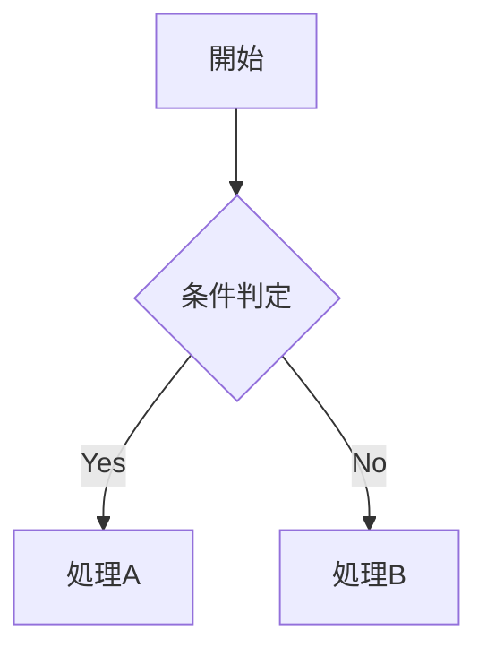

## サマリー

本調査では、ワークフロー実行中に発生した3つの問題の根本原因を特定した。

- 目的: definitions.ts のサマリーテンプレートとバリデーター要件の乖離、flowchart ノード記法制約の欠如、MEMORY.md 編集が enforce-workflow フックにブロックされる原因を調査すること
- 主要な決定事項: 問題1はテンプレートの bullet 点数（3項目＝4行）がバリデーター要件（5行）を下回ることが原因と確定した。問題2は CLAUDE.md および definitions.ts に flowchart ノード記法（丸括弧 vs 角括弧）の使い分けに関する明示的な制約が存在しないことが原因と確定した。問題3は enforce-workflow.js の WORKFLOW_CONFIG_PATTERNS が memory/ ディレクトリを含まず、かつタスク未開始時は全ファイル書き込みをブロックすることが原因と確定した。
- 次フェーズで必要な情報: 各問題の修正対象ファイルは definitions.ts（問題1と問題2）および enforce-workflow.js（問題3）であり、具体的な修正内容は requirements フェーズで確定させる。
- 影響範囲: workflow-plugin/mcp-server/src/phases/definitions.ts および workflow-plugin/hooks/enforce-workflow.js の2ファイルが主要な修正対象となる。
- 緊急度評価: 問題1は毎回のサマリーセクション生成でバリデーション失敗リスクを発生させるため高優先度である。

## 問題1の調査結果

### サマリーテンプレートの現状コード

`C:\ツール\Workflow\workflow-plugin\mcp-server\src\phases\definitions.ts` の行1249〜1255を調査した。

行1251でサマリーテンプレートを1行の文字列連結として生成している:

```
importantSection += `成果物の先頭には必ず以下のセクションを配置してください:\n
\n## サマリー\n\n（${rules.maxSummaryLines}行以内で、このドキュメントの要点を記述）\n
- 目的: このドキュメントの目的\n
- 主要な決定事項: 重要な設計決定や技術選定\n
- 次フェーズで必要な情報: 後続フェーズで必須となる情報\n\n`;
```

このテンプレートが subagent に渡されたとき、サマリーセクション内に生成される実質行は以下の4行のみとなる:

1. `（200行以内で、このドキュメントの要点を記述）` — 説明行（実質行としてカウントされる）
2. `- 目的: このドキュメントの目的` — bullet 1（実質行）
3. `- 主要な決定事項: 重要な設計決定や技術選定` — bullet 2（実質行）
4. `- 次フェーズで必要な情報: 後続フェーズで必須となる情報` — bullet 3（実質行）

### minSectionLines の値

行38に定義されている:

```
minSectionDensity: 0.3, minSectionLines: 5, maxSummaryLines: 200, ...
```

`minSectionLines` の値は **5** である。

### 乖離の確認

テンプレートが示す4行に対し、バリデーターが要求するのは5行であるため、subagent がテンプレートを忠実に再現するだけでは1行不足する。この乖離が「サマリーセクションに最低5行の実質行が必要」というバリデーションエラーの直接的な原因となっている。行1094でバリデーター側の要求値が確認できる: `qualitySection += \`- 各セクション内に最低${rules.minSectionLines}行の実質行を含めること\n\``. バリデーター値と定義値は整合しているが、テンプレートの例示行数だけが不足している。

## 問題2の調査結果

### flowchart ノード記法に関する definitions.ts の現状

行1179〜1182でMermaid図に関するガイダンスが生成されている:

```
qualitySection += `\n### Mermaid図の構造検証\n`;
qualitySection += `- stateDiagram-v2では最低${rules.mermaidMinStates}つの状態と${rules.mermaidMinTransitions}つの遷移が必要\n`;
qualitySection += `- flowchartでも最低${rules.mermaidMinStates}ノードと${rules.mermaidMinTransitions}エッジが必要\n`;
qualitySection += `- stateDiagram-v2では開始・終了に名前付き状態（Start, End）を使うこと\n`;
```

flowchart に関する記述は「最低ノード数とエッジ数」の数量要件のみであり、ノードの**記法形式**（丸括弧 vs 角括弧 vs 二重引用符付き角括弧）に関する制約は一切記載されていない。

### artifact-validator.ts のノード検出ロジック

行699〜714に flowchart のバリデーションロジックが存在する:

```
if (content.includes('flowchart')) {
  const nodes = new Set<string>();
  const nodePattern = /(\w+)[\[\(\{]/g;
  // ...
```

正規表現 `/(\w+)[\[\(\{]/g` は `NodeID[`、`NodeID(`、`NodeID{` の3形式を検出する。`NodeID["日本語テキスト"]` 形式は `NodeID[` にマッチするため構造検証は通過するが、この記法の使用可否についての明示的な文書化は存在しない。

### CLAUDE.md での flowchart 例示

CLAUDE.md（ルート）の「図式設計」セクションでは以下の例が示されている:



ここでは `A[開始]` 形式（シングル角括弧＋日本語直書き）が例示されているが、`A["開始"]` 形式（二重引用符付き）や `A(開始)` 形式（丸括弧）との使い分けに関するガイダンスは存在しない。subagent が `NodeID["text with spaces"]` 形式を使用してもバリデーターは通過するが、プレースホルダー角括弧検出との干渉リスクについての説明がないため、subagent が混乱する可能性がある。

## 問題3の調査結果

### enforce-workflow.js の MEMORY.md に関するブロックロジック

`C:\ツール\Workflow\workflow-plugin\hooks\enforce-workflow.js` を調査した。

行219〜224に `WORKFLOW_CONFIG_PATTERNS` が定義されている:

```javascript
const WORKFLOW_CONFIG_PATTERNS = [
  /workflow-state\.json$/i,
  /\.claude[\/\\]settings\.json$/i,
  /\.claude[\/\\]state[\/\\].*\.json$/i,
  /\.claude-.*\.json$/i,
];
```

MEMORY.md のパスは `C:\Users\owner\.claude\projects\C------Workflow\memory\MEMORY.md` であり、上記パターンのいずれにも該当しない。`.claude` ディレクトリに関するパターン（行221〜222）は `settings.json` または `.claude/state/` 以下の `.json` ファイルのみを許可しており、`memory/MEMORY.md` は対象外である。

### タスク未開始時のブロックロジック

行364〜378:

```javascript
if (tasks.length === 0) {
  console.log('ファイルを編集するには、まずタスクを開始してください。');
  // ...
  process.exit(2);
}
```

タスクが0件（idle 状態またはすべて completed 状態）のとき、enforce-workflow.js はすべてのファイル書き込みを exit code 2 でブロックする。MEMORY.md への書き込みはこのブロックに該当する。

### phase-edit-guard.js の ALWAYS_ALLOWED_PATTERNS

行215〜219:

```javascript
const ALWAYS_ALLOWED_PATTERNS = [
  /workflow-state\.json$/i,
];
```

phase-edit-guard.js の常時許可パターンは `workflow-state.json` のみであり、`memory/` ディレクトリは含まれない。

### ブロックが発生する経路の整理

ファイル書き込み時に呼ばれるフックの実行順序（settings.json 行3〜13の定義）:

1. enforce-workflow.js がタスク一覧を確認
2. タスクが0件または全て completed の場合 → exit(2) でブロック
3. タスクが存在する場合 → WORKFLOW_CONFIG_PATTERNS でパスチェック
4. memory/MEMORY.md は WORKFLOW_CONFIG_PATTERNS にマッチしないため、次のフェーズチェックへ
5. research フェーズ以外では `.md` 編集が制限されるケースあり

MEMORY.md がブロックされる主要経路は「タスク未開始時のゼロタスクブロック」であり、アクティブタスクが存在する場合は research/requirements 等の `.md` 編集許可フェーズであれば通過する可能性がある。ただしフェーズによっては phase-edit-guard.js のファイルタイプチェックが追加的にブロックする場合がある。根本的な解決策は enforce-workflow.js の WORKFLOW_CONFIG_PATTERNS に memory/ ディレクトリを追加することである。
