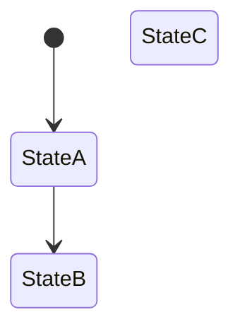
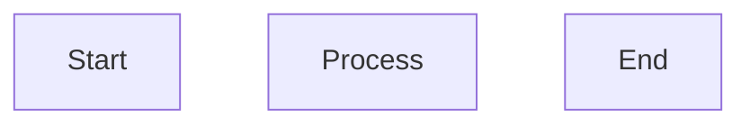
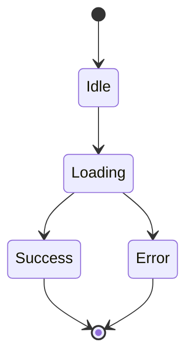
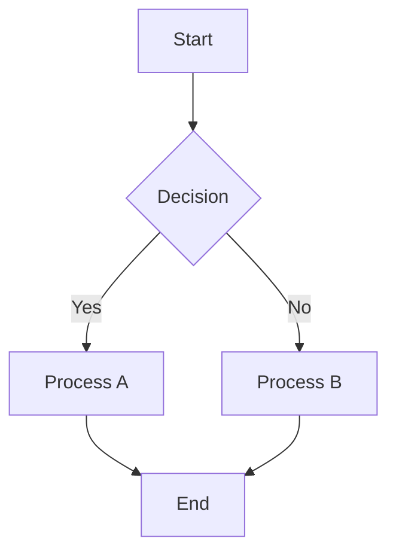

# テスト設計書: ワークフロー1000万行対応強化

**文書作成日**: 2026-02-07
**フェーズ**: test_design
**バージョン**: 1.0
**関連仕様書**: `spec.md`, `requirements.md`

---

## 1. 概要

### 1.1 目的

本テスト設計書は、ワークフローMCPサーバーにおける4つの致命的なセキュリティ/品質検証問題の解決策が正しく実装されたことを検証するための詳細なテストケースを定義する。

### 1.2 テストスコープ

**対象:**
- REQ-1: テスト結果偽造防止（`record-test-result.ts`）
- REQ-2: 設計検証の強化（`design-validator.ts`, `ast-analyzer.ts`）
- REQ-3: スコープ検証の強化（`set-scope.ts`, `dependency-analyzer.ts`）
- REQ-4: 環境変数バイパスの監査（`audit/logger.ts`, フック群）

**対象外:**
- フロントエンド（存在しない）
- バックエンドAPI（存在しない）
- 既存機能の回帰（別途回帰テストで実施）

### 1.3 テスト環境

- **Node.js**: 18.x以上
- **テストフレームワーク**: vitest
- **実行環境**: Linux/macOS/WSL2
- **プロジェクトルート**: `/mnt/c/ツール/Workflow/workflow-plugin/mcp-server`
- **テストディレクトリ**: `src/**/__tests__/`

---

## 2. テストカテゴリと優先度

| カテゴリ | REQ | 優先度 | テスト数 |
|---------|-----|--------|---------|
| テスト結果偽造防止 | REQ-1 | Critical | 8 |
| 設計検証強化 | REQ-2 | High | 8 |
| スコープ検証強化 | REQ-3 | High | 7 |
| 環境変数バイパス監査 | REQ-4 | Critical | 5 |
| **合計** | - | - | **28** |

---

## 3. REQ-1: テスト結果偽造防止テスト

### 3.1 テストファイル

**ファイルパス**: `src/tools/__tests__/record-test-result-enhanced.test.ts`

### 3.2 テストケース

#### TC-1.1: exitCode=0 + FAILキーワード → ブロック

**テスト内容**: `exitCode=0`だが、出力に`FAILED`キーワードが含まれる場合、記録をブロックする。

**前提条件**:
- タスクが`testing`フェーズにある
- タスク状態が正常に保存されている

**入力データ**:
```typescript
taskId: "test-task-1"
exitCode: 0
summary: undefined
output: "✓ should validate input\n✗ should handle errors\n\n5 tests passed, 2 FAILED"
```

**期待される出力**:
```typescript
{
  success: false,
  message: "テスト出力に失敗を示すキーワードが含まれていますが、exitCodeは0（成功）です。テスト実行結果を確認してください。"
}
```

**テスト種別**: ユニットテスト

**検証項目**:
- `success`が`false`であること
- エラーメッセージに「失敗を示すキーワード」が含まれること
- `TaskState.testResults`に記録されていないこと

---

#### TC-1.2: exitCode=0 + "Error"キーワード → ブロック

**テスト内容**: `exitCode=0`だが、出力に`Error`キーワードが含まれる場合、記録をブロックする。

**前提条件**:
- タスクが`testing`フェーズにある

**入力データ**:
```typescript
taskId: "test-task-2"
exitCode: 0
summary: undefined
output: "Tests completed. 3 passed, 2 Errors detected in validation."
```

**期待される出力**:
```typescript
{
  success: false,
  message: "テスト出力に失敗を示すキーワードが含まれていますが、exitCodeは0（成功）です。テスト実行結果を確認してください。"
}
```

**テスト種別**: ユニットテスト

---

#### TC-1.3: exitCode=1 + "passed"のみ → ブロック

**テスト内容**: `exitCode=1`だが、出力に`all tests passed`が含まれ、FAILキーワードがない場合、ブロックする。

**前提条件**:
- タスクが`testing`フェーズにある

**入力データ**:
```typescript
taskId: "test-task-3"
exitCode: 1
summary: undefined
output: "All tests passed successfully! Great job!"
```

**期待される出力**:
```typescript
{
  success: false,
  message: "テスト出力は全テスト成功を示していますが、exitCodeは非ゼロ（失敗）です。テスト実行結果を確認してください。"
}
```

**テスト種別**: ユニットテスト

---

#### TC-1.4: exitCode=0 + 正常なテスト出力 → 成功

**テスト内容**: `exitCode=0`で、正常なテストフレームワーク出力がある場合、成功する。

**前提条件**:
- タスクが`testing`フェーズにある

**入力データ**:
```typescript
taskId: "test-task-4"
exitCode: 0
summary: undefined
output: "✓ should validate input (15ms)\n✓ should handle errors (8ms)\n\n5 tests passed"
```

**期待される出力**:
```typescript
{
  success: true,
  taskId: "test-task-4",
  phase: "testing",
  result: {
    phase: "testing",
    exitCode: 0,
    timestamp: /* ISO8601 */,
    passedCount: 5,
    failedCount: 0,
    output: /* truncated */
  },
  message: "テスト結果を記録しました（exitCode: 0）"
}
```

**テスト種別**: ユニットテスト

**検証項目**:
- `success`が`true`であること
- `TaskState.testResults`に記録されていること
- `passedCount`が正しく抽出されること（5）

---

#### TC-1.5: exitCode=1 + "5 tests passed, 2 failed" → 成功

**テスト内容**: `exitCode=1`で、失敗とパスの両方が記載されている場合、成功する。

**前提条件**:
- タスクが`testing`フェーズにある

**入力データ**:
```typescript
taskId: "test-task-5"
exitCode: 1
summary: undefined
output: "Tests: 5 passed, 2 failed, 7 total\n  FAIL src/user.test.ts"
```

**期待される出力**:
```typescript
{
  success: true,
  taskId: "test-task-5",
  phase: "testing",
  result: {
    exitCode: 1,
    passedCount: 5,
    failedCount: 2,
    /* ... */
  },
  message: "テスト結果を記録しました（exitCode: 1）"
}
```

**テスト種別**: ユニットテスト

---

#### TC-1.6: テストフレームワーク構造なし → 警告

**テスト内容**: `exitCode=0`だが、テストフレームワークのパターンが検出されない場合、警告を出す。

**前提条件**:
- タスクが`testing`フェーズにある

**入力データ**:
```typescript
taskId: "test-task-6"
exitCode: 0
summary: undefined
output: "Everything is fine. No problems detected. This is a very long output that exceeds 50 characters."
```

**期待される出力**:
```typescript
{
  success: true,
  taskId: "test-task-6",
  /* ... */
}
```

**テスト種別**: ユニットテスト

**検証項目**:
- `success`が`true`であること（警告のみ）
- コンソール警告が出力されること（`console.warn`のスパイで検証）
- 警告内容に「テストフレームワークの構造が検出されませんでした」が含まれること

---

#### TC-1.7: スタックトレースを含むexitCode=0 → 警告

**テスト内容**: `exitCode=0`だが、スタックトレースパターンが含まれる場合、警告を出す。

**前提条件**:
- タスクが`testing`フェーズにある

**入力データ**:
```typescript
taskId: "test-task-7"
exitCode: 0
summary: undefined
output: "5 tests passed\nat UserService.getUser (src/user.ts:10:5)\nExpected 5 but got 10"
```

**期待される出力**:
```typescript
{
  success: true,
  /* ... */
}
```

**テスト種別**: ユニットテスト

**検証項目**:
- `success`が`true`であること（警告のみ）
- コンソール警告に「エラーパターン（スタックトレース等）が含まれています」が含まれること

---

#### TC-1.8: output長さ不足 → ブロック

**テスト内容**: `output`が50文字未満の場合、ブロックする。

**前提条件**:
- タスクが`testing`フェーズにある

**入力データ**:
```typescript
taskId: "test-task-8"
exitCode: 0
summary: undefined
output: "5 tests passed"  // 15文字のみ
```

**期待される出力**:
```typescript
{
  success: false,
  message: "outputは50文字以上必要です。テスト実行の完全な出力を指定してください"
}
```

**テスト種別**: ユニットテスト

---

## 4. REQ-2: 設計検証強化テスト

### 4.1 テストファイル

**ファイルパス**:
- `src/validation/__tests__/ast-analyzer.test.ts`
- `src/validation/__tests__/design-validator-enhanced.test.ts`

### 4.2 テストケース

#### TC-2.1: 空のクラスを検出

**テスト内容**: `class Foo {}`のような空のクラスを検出する。

**前提条件**:
- テスト用の一時ファイルを作成

**入力データ**:
```typescript
// test-class-empty.ts
export class EmptyClass {}
```

**期待される出力**:
```typescript
[
  {
    className: "EmptyClass",
    memberCount: 0,
    isEmpty: true
  }
]
```

**テスト種別**: ユニットテスト

**検証項目**:
- `analyzeClasses`関数が空のクラスを正しく検出すること
- `isEmpty`が`true`であること
- `memberCount`が`0`であること

**クリーンアップ**: テスト終了後、一時ファイルを削除

---

#### TC-2.2: プロパティありクラスを検出

**テスト内容**: メンバーを持つクラスが正しく解析される。

**前提条件**:
- テスト用の一時ファイルを作成

**入力データ**:
```typescript
// test-class-members.ts
class User {
  name: string;
  email: string;

  getUser() {
    return this.name;
  }
}
```

**期待される出力**:
```typescript
[
  {
    className: "User",
    memberCount: 3,  // name, email, getUser
    isEmpty: false
  }
]
```

**テスト種別**: ユニットテスト

---

#### TC-2.3: 空のメソッドを検出

**テスト内容**: `method() {}`のような空のメソッドを検出する。

**前提条件**:
- テスト用の一時ファイルを作成

**入力データ**:
```typescript
// test-method-empty.ts
class Foo {
  bar() {}
}
```

**期待される出力**:
```typescript
[
  {
    methodName: "bar",
    statementCount: 0,
    isEmpty: true,
    isOnlyReturn: false
  }
]
```

**テスト種別**: ユニットテスト

**検証項目**:
- `analyzeMethods`関数が空のメソッドを正しく検出すること
- `isEmpty`が`true`であること

---

#### TC-2.4: 単なるreturnのみのメソッドを検出

**テスト内容**: `method() { return; }`のような単純なメソッドを検出する。

**前提条件**:
- テスト用の一時ファイルを作成

**入力データ**:
```typescript
// test-method-return.ts
class Foo {
  bar() { return; }
}
```

**期待される出力**:
```typescript
[
  {
    methodName: "bar",
    statementCount: 1,
    isEmpty: false,
    isOnlyReturn: true
  }
]
```

**テスト種別**: ユニットテスト

---

#### TC-2.5: ステートマシンの孤立ノード検出

**テスト内容**: 遷移のないノードを検出する。

**前提条件**: なし

**入力データ**:


**期待される出力**:
```typescript
{
  nodeCount: 3,  // StateA, StateB, StateC
  edgeCount: 2,  // [*]->A, A->B
  isolatedNodes: ["StateC"]
}
```

**テスト種別**: ユニットテスト

**検証項目**:
- `analyzeStateMachine`関数が孤立ノードを正しく検出すること
- `isolatedNodes`配列に`StateC`が含まれること

---

#### TC-2.6: フローチャートのエッジなし検出

**テスト内容**: ノードはあるがエッジがない場合を検出する。

**前提条件**: なし

**入力データ**:


**期待される出力**:
```typescript
{
  nodeCount: 3,
  edgeCount: 0,
  isolatedNodes: ["A", "B", "C"]
}
```

**テスト種別**: ユニットテスト

**検証項目**:
- `analyzeFlowchart`関数がエッジなしを検出すること
- `edgeCount`が`0`であること
- 全ノードが`isolatedNodes`に含まれること

---

#### TC-2.7: 正常なステートマシン

**テスト内容**: 遷移があるステートマシンは正常に解析される。

**前提条件**: なし

**入力データ**:


**期待される出力**:
```typescript
{
  nodeCount: 4,  // Idle, Loading, Success, Error
  edgeCount: 6,
  isolatedNodes: []
}
```

**テスト種別**: ユニットテスト

---

#### TC-2.8: 正常なフローチャート

**テスト内容**: 接続があるフローチャートは正常に解析される。

**前提条件**: なし

**入力データ**:


**期待される出力**:
```typescript
{
  nodeCount: 5,
  edgeCount: 5,
  isolatedNodes: []
}
```

**テスト種別**: ユニットテスト

---

## 5. REQ-3: スコープ検証強化テスト

### 5.1 テストファイル

**ファイルパス**:
- `src/tools/__tests__/set-scope-enhanced.test.ts`
- `src/validation/__tests__/dependency-analyzer.test.ts`

### 5.2 テストケース

#### TC-3.1: 存在しないファイルパス → ブロック

**テスト内容**: スコープに存在しないファイルが含まれる場合、ブロックする。

**前提条件**:
- タスクが`research`フェーズにある

**入力データ**:
```typescript
taskId: "test-task-scope-1"
files: ["src/nonexistent.ts", "src/fake.ts"]
dirs: []
```

**期待される出力**:
```typescript
{
  success: false,
  message: "存在しないファイル: src/nonexistent.ts, src/fake.ts"
}
```

**テスト種別**: ユニットテスト

**検証項目**:
- `success`が`false`であること
- エラーメッセージに存在しないファイル名が含まれること

---

#### TC-3.2: 存在しないディレクトリ → ブロック

**テスト内容**: スコープに存在しないディレクトリが含まれる場合、ブロックする。

**前提条件**:
- タスクが`requirements`フェーズにある

**入力データ**:
```typescript
taskId: "test-task-scope-2"
files: []
dirs: ["src/fake-dir", "lib/non-exist"]
```

**期待される出力**:
```typescript
{
  success: false,
  message: "存在しないディレクトリ: src/fake-dir, lib/non-exist"
}
```

**テスト種別**: ユニットテスト

---

#### TC-3.3: 空のスコープ → ブロック

**テスト内容**: `files`と`dirs`が両方とも空の場合、ブロックする。

**前提条件**:
- タスクが`planning`フェーズにある

**入力データ**:
```typescript
taskId: "test-task-scope-3"
files: []
dirs: []
```

**期待される出力**:
```typescript
{
  success: false,
  message: "files または dirs の少なくとも1つを指定してください"
}
```

**テスト種別**: ユニットテスト

---

#### TC-3.4: import文解析 - ES6 import

**テスト内容**: ES6形式のimport文を正しく抽出する。

**前提条件**:
- テスト用の一時ファイルを作成

**入力データ**:
```typescript
// test-imports.ts
import { foo } from './utils';
import * as bar from '../helpers';
import type { User } from './types';
```

**期待される出力**:
```typescript
[
  { from: "./utils", resolvedPath: /* absolute path */, exists: true },
  { from: "../helpers", resolvedPath: /* absolute path */, exists: true },
  { from: "./types", resolvedPath: /* absolute path */, exists: true }
]
```

**テスト種別**: ユニットテスト

**検証項目**:
- `extractImports`関数が全てのimport文を抽出すること
- 相対パスが正しく解決されること

---

#### TC-3.5: require解析 - CommonJS require

**テスト内容**: CommonJS形式のrequireを正しく抽出する。

**前提条件**:
- テスト用の一時ファイルを作成

**入力データ**:
```javascript
// test-require.js
const foo = require('./utils');
const bar = require('../helpers');
```

**期待される出力**:
```typescript
[
  { from: "./utils", resolvedPath: /* absolute path */, exists: true },
  { from: "../helpers", resolvedPath: /* absolute path */, exists: true }
]
```

**テスト種別**: ユニットテスト

---

#### TC-3.6: スコープ外依存検出 → 警告

**テスト内容**: スコープに含まれていない依存ファイルがある場合、警告を出す。

**前提条件**:
- テスト用ファイル構造を作成
  - `src/feature.ts` → `import { validate } from './utils'`
  - `src/utils.ts` → 存在する

**入力データ**:
```typescript
taskId: "test-task-scope-6"
files: ["src/feature.ts"]
dirs: []
```

**期待される出力**:
```typescript
{
  success: true,
  taskId: "test-task-scope-6",
  scope: { affectedFiles: ["src/feature.ts"], affectedDirs: [] },
  warnings: ["スコープ外依存が1件検出されました（詳細はコンソールを確認）"],
  message: "影響範囲を設定しました（ファイル: 1件, ディレクトリ: 0件）"
}
```

**テスト種別**: ユニットテスト

**検証項目**:
- `success`が`true`であること（警告のみ）
- コンソール出力に依存ファイル名が含まれること
- 推奨スコープが提案されること

---

#### TC-3.7: スコープ内の全依存 → 警告なし

**テスト内容**: 依存ファイルが全てスコープに含まれる場合、警告が出ない。

**前提条件**:
- テスト用ファイル構造を作成
  - `src/feature.ts` → `import { validate } from './utils'`
  - `src/utils.ts` → 存在する

**入力データ**:
```typescript
taskId: "test-task-scope-7"
files: ["src/feature.ts", "src/utils.ts"]
dirs: []
```

**期待される出力**:
```typescript
{
  success: true,
  taskId: "test-task-scope-7",
  scope: { affectedFiles: ["src/feature.ts", "src/utils.ts"], affectedDirs: [] },
  message: "影響範囲を設定しました（ファイル: 2件, ディレクトリ: 0件）"
  // warningsプロパティなし
}
```

**テスト種別**: ユニットテスト

**検証項目**:
- `warnings`プロパティが存在しないこと
- コンソール警告が出力されないこと

---

## 6. REQ-4: 環境変数バイパス監査テスト

### 6.1 テストファイル

**ファイルパス**: `src/audit/__tests__/logger.test.ts`

### 6.2 テストケース

#### TC-4.1: SKIP_PHASE_GUARD=true → ログ記録

**テスト内容**: `SKIP_PHASE_GUARD=true`使用時に監査ログに記録される。

**前提条件**:
- テスト用の一時ディレクトリを作成
- `AuditLogger`インスタンスを作成

**入力データ**:
```typescript
logger.log({
  event: "bypass_enabled",
  variable: "SKIP_PHASE_GUARD",
  taskId: "task123",
  phase: "implementation"
})
```

**期待される出力**:
```jsonl
{"timestamp":"2026-02-07T10:00:00.123Z","event":"bypass_enabled","variable":"SKIP_PHASE_GUARD","taskId":"task123","phase":"implementation"}
```

**テスト種別**: ユニットテスト

**検証項目**:
- ログファイル（`.jsonl`）が作成されること
- ログエントリがJSONL形式で記録されること
- `timestamp`がISO8601形式であること
- `event`が`bypass_enabled`であること

**クリーンアップ**: テスト終了後、一時ログファイルを削除

---

#### TC-4.2: FAIL_OPEN=true → ログ記録

**テスト内容**: `FAIL_OPEN=true`使用時に監査ログに記録される。

**前提条件**:
- `AuditLogger`インスタンスを作成

**入力データ**:
```typescript
logger.log({
  event: "bypass_enabled",
  variable: "FAIL_OPEN",
  taskId: "task456",
  phase: "testing"
})
```

**期待される出力**:
```jsonl
{"timestamp":"...","event":"bypass_enabled","variable":"FAIL_OPEN","taskId":"task456","phase":"testing"}
```

**テスト種別**: ユニットテスト

---

#### TC-4.3: バイパス未使用 → ログ記録なし

**テスト内容**: バイパス環境変数が設定されていない場合、ログに記録されない。

**前提条件**:
- ログファイルが存在しない、または空

**入力データ**:
- 環境変数: なし（バイパスなし）

**期待される出力**:
- ログファイルが作成されない、または空のまま

**テスト種別**: ユニットテスト

**検証項目**:
- `AuditLogger.log`が呼び出されないこと
- ログファイルサイズが0バイトであること

---

#### TC-4.4: 1時間に11回超のバイパス → 閾値超過警告

**テスト内容**: 1時間に11回のバイパスログを記録すると、閾値超過イベントが記録される。

**前提条件**:
- `AuditLogger`インスタンスを作成

**入力データ**:
```typescript
// 11回のバイパスログを記録
for (let i = 0; i < 11; i++) {
  logger.log({
    event: "bypass_enabled",
    variable: "SKIP_PHASE_GUARD"
  });
}

// 閾値チェック実行
logger.checkThreshold(10);
```

**期待される出力**:
- コンソール警告: `バイパス使用回数が閾値を超えました（11 > 10）`
- ログファイルに閾値超過イベント:
  ```jsonl
  {"timestamp":"...","event":"bypass_threshold_exceeded","count":11,"window":"1h"}
  ```

**テスト種別**: ユニットテスト

**検証項目**:
- `countRecentBypasses()`が11を返すこと
- コンソール警告が出力されること（`console.warn`のスパイで検証）
- 閾値超過ログが記録されること

---

#### TC-4.5: ログファイル10MB超 → ローテーション実行

**テスト内容**: ログファイルが10MBを超えるとローテーションが実行される。

**前提条件**:
- `AuditLogger`インスタンスを作成（maxLogSize: 100バイト、テスト用に小さく設定）

**入力データ**:
```typescript
// 100バイト超のログを書き込み
for (let i = 0; i < 10; i++) {
  logger.log({
    event: "bypass_enabled",
    variable: "SKIP_PHASE_GUARD",
    taskId: `task-${i}`
  });
}
```

**期待される出力**:
- `audit-log.jsonl.1`ファイルが作成される
- 新しい`audit-log.jsonl`が空または小さいサイズになる

**テスト種別**: ユニットテスト

**検証項目**:
- ローテーション後、`.1`ファイルが存在すること
- 元のログファイルサイズが100バイト未満になること
- `.1`ファイルに過去のログが含まれること

**クリーンアップ**: テスト終了後、全てのローテーションファイルを削除

---

## 7. テスト実行方法

### 7.1 全テスト実行

```bash
cd /mnt/c/ツール/Workflow/workflow-plugin/mcp-server
pnpm test
```

### 7.2 特定カテゴリのテスト実行

```bash
# REQ-1: テスト結果偽造防止
pnpm test src/tools/__tests__/record-test-result-enhanced.test.ts

# REQ-2: 設計検証強化
pnpm test src/validation/__tests__/ast-analyzer.test.ts
pnpm test src/validation/__tests__/design-validator-enhanced.test.ts

# REQ-3: スコープ検証強化
pnpm test src/tools/__tests__/set-scope-enhanced.test.ts
pnpm test src/validation/__tests__/dependency-analyzer.test.ts

# REQ-4: 監査ログ
pnpm test src/audit/__tests__/logger.test.ts
```

### 7.3 カバレッジレポート生成

```bash
pnpm test --coverage
```

**目標カバレッジ**: 新規コードの80%以上

---

## 8. テストデータ管理

### 8.1 フィクスチャファイル

**配置先**: `src/backend/tests/fixtures/`

**ファイル構成**:
```
fixtures/
├── input/
│   ├── test-class-empty.ts           # 空のクラス
│   ├── test-class-members.ts         # メンバーありクラス
│   ├── test-method-empty.ts          # 空のメソッド
│   ├── test-imports.ts               # ES6 import
│   └── test-require.js               # CommonJS require
├── state-machines/
│   ├── isolated-nodes.mmd            # 孤立ノード
│   └── normal.mmd                    # 正常なステートマシン
└── flowcharts/
    ├── no-edges.mmd                  # エッジなし
    └── normal.mmd                    # 正常なフローチャート
```

### 8.2 モックデータ

タスク状態のモックデータ:

```typescript
const mockTaskState = {
  taskId: "test-task-1",
  taskName: "Test Task",
  phase: "testing",
  workflowDir: "/tmp/test-workflow",
  testResults: [],
  scope: {
    affectedFiles: [],
    affectedDirs: []
  }
};
```

---

## 9. テスト成功基準

### 9.1 機能基準

- [ ] REQ-1: 全8テストケースがパス
- [ ] REQ-2: 全8テストケースがパス
- [ ] REQ-3: 全7テストケースがパス
- [ ] REQ-4: 全5テストケースがパス

### 9.2 品質基準

- [ ] ユニットテストカバレッジ: 新規コードの80%以上
- [ ] 全テストケースが緑（0件の失敗）
- [ ] エッジケース（境界値、異常系）が網羅されている
- [ ] テスト実行時間: 全体で10秒以内

### 9.3 非機能基準

- [ ] テストコードがDRY原則に従っている
- [ ] テストが独立している（他のテストに依存しない）
- [ ] クリーンアップが確実に実行される（一時ファイル削除）
- [ ] テストログが読みやすい（describeブロックの構造化）

---

## 10. テスト実装ガイドライン

### 10.1 命名規則

```typescript
describe('workflowRecordTestResult', () => {
  describe('整合性検証', () => {
    it('AC-1.1: exitCode=0 + FAILキーワード → ブロック', () => {
      // テストコード
    });
  });
});
```

### 10.2 共通ユーティリティ

**ファイル**: `src/__tests__/helpers/test-utils.ts`

```typescript
/**
 * 一時ファイルを作成
 */
export function createTempFile(content: string, extension: string): string {
  const filePath = `/tmp/test-${Date.now()}.${extension}`;
  fs.writeFileSync(filePath, content, 'utf-8');
  return filePath;
}

/**
 * 一時ディレクトリを作成
 */
export function createTempDir(): string {
  const dirPath = `/tmp/test-dir-${Date.now()}`;
  fs.mkdirSync(dirPath, { recursive: true });
  return dirPath;
}

/**
 * クリーンアップ（afterEach用）
 */
export function cleanupTemp(paths: string[]): void {
  for (const p of paths) {
    if (fs.existsSync(p)) {
      if (fs.statSync(p).isDirectory()) {
        fs.rmSync(p, { recursive: true });
      } else {
        fs.unlinkSync(p);
      }
    }
  }
}
```

### 10.3 スパイとモック

```typescript
import { vi } from 'vitest';

// コンソール警告のスパイ
const consoleWarnSpy = vi.spyOn(console, 'warn').mockImplementation(() => {});

// テスト後にリセット
afterEach(() => {
  consoleWarnSpy.mockRestore();
});
```

---

## 11. テストカバレッジ計測

### 11.1 カバレッジ対象

| ファイル | 目標カバレッジ |
|---------|---------------|
| `record-test-result.ts` | 85% |
| `ast-analyzer.ts` | 80% |
| `design-validator.ts` | 80% |
| `dependency-analyzer.ts` | 80% |
| `set-scope.ts` | 85% |
| `audit/logger.ts` | 80% |

### 11.2 カバレッジ除外

- エラーハンドリングの`catch`ブロック（一部）
- ログ出力のみの処理
- 型定義ファイル（`.d.ts`）

---

## 12. テストスケジュール

| フェーズ | 期間 | 担当 |
|---------|------|------|
| テスト実装 | test_implフェーズ | AI Agent |
| テスト実行・修正 | testingフェーズ | AI Agent |
| カバレッジ確認 | parallel_qualityフェーズ | AI Agent |
| テスト結果報告 | docs_updateフェーズ | AI Agent |

---

## 13. リスクと対策

### 13.1 テスト環境依存のリスク

**リスク**: ファイルシステムの権限エラーでテストが失敗する

**対策**:
- `/tmp`ディレクトリを使用（書き込み権限あり）
- テスト前に権限チェックを実施
- 権限エラー時はスキップ

### 13.2 非同期処理のリスク

**リスク**: ファイル書き込みが完了する前にテストが終了する

**対策**:
- 同期API（`fs.writeFileSync`）を使用
- 非同期が必要な場合は`await`を使用

### 13.3 並列実行のリスク

**リスク**: 複数のテストが同じファイルを操作して干渉する

**対策**:
- ファイル名にタイムスタンプ/ランダム値を含める
- テストごとに一時ディレクトリを分離

---

## 14. 参考資料

- `spec.md`: 実装仕様書
- `requirements.md`: 要件定義書
- `state-machine.mmd`: ステートマシン図
- `flowchart.mmd`: フローチャート
- vitest公式ドキュメント: https://vitest.dev/

---

**文書承認**: test_design フェーズ完了
**次のフェーズ**: test_impl（テスト実装）
