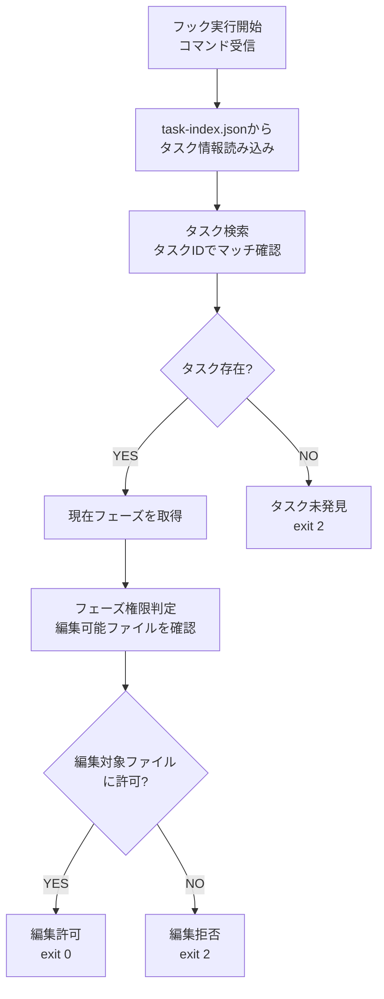
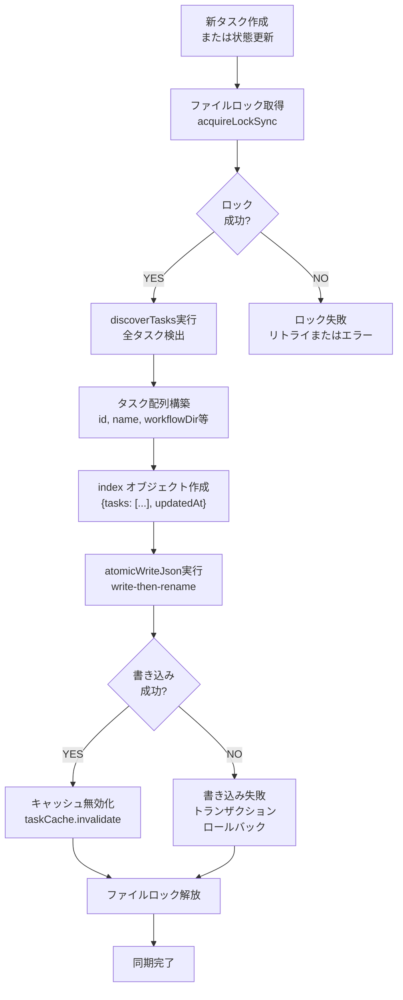
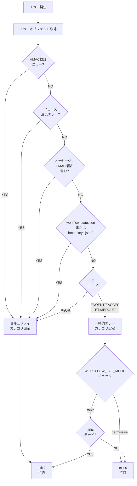
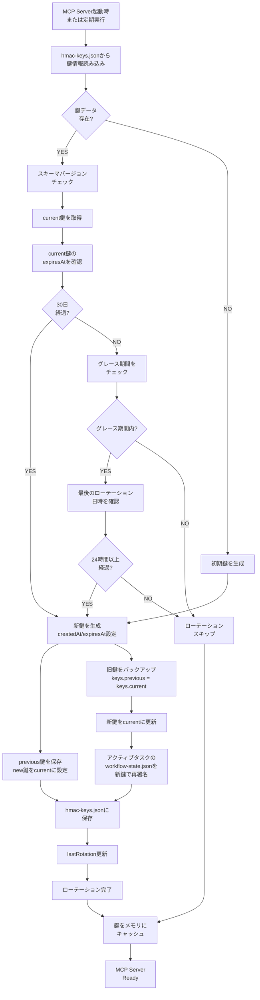

# フローチャート設計: ワークフロー10M対応全問題根本原因修正

## サマリー

ワークフロープラグインの修正対象となる4つの主要処理フローを定義する。各フローは specification に基づいたMermaid形式で図式化し、実装段階での参照用資料として使用される。

## フロー1: フック実行フロー

### 概要

コマンド受信からファイル編集可否判定までのフロー。Hookシステムがtask-index.jsonを読み込み、タスクとフェーズを確認し、編集権限を判定する。

### フロー図（Mermaid形式）



### 主要ステップ

1. **フック実行開始**: Bashコマンド受信時にhooks/phase-edit-guard.js起動
2. **タスク情報読み込み**: task-index.jsonからHookスキーマ形式のデータ読み込み
3. **タスク検索**: コマンド編集対象のtaskIdから該当タスク検索
4. **タスク存在判定**: タスク見つからない場合→exit 2でブロック
5. **フェーズ取得**: 見つかったタスクの現在フェーズ確認
6. **権限判定**: フェーズに応じた編集可能ファイルリストと照合
7. **判定結果**: 許可時exit 0、拒否時exit 2

---

## フロー2: task-index.json同期フロー

### 概要

MCP serverが新タスク作成時またはタスク状態更新時に実行する。discoverTasksでタスク情報を検出し、Hookスキーマ形式で task-index.jsonに アトミックに書き込む。ファイルロックによる排他制御を実施。

### フロー図（Mermaid形式）



### 主要ステップ

1. **ロック取得**: acquireLockSyncでファイル排他制御開始
   - ロック失敗時はリトライまたはエラー返却
2. **タスク検出**: discoverTasksで全タスク情報を検出
   - workflow-state.jsonファイルをスキャン
3. **インデックス構築**: 各タスクをHookスキーマ形式に変換
   - スキーマ: `{id, name, workflowDir, docsDir, phase, updatedAt}`
4. **インデックスオブジェクト作成**: `{tasks: [...], updatedAt}`形式で生成
5. **アトミック書き込み**: write-then-renameパターンで原子性を保証
   - 一時ファイル書き込み → リネーム
6. **キャッシュ無効化**: taskCache.invalidateで古いキャッシュを削除
7. **ロック解放**: 排他制御を終了

### 重要な設計ポイント

- **アトミック性**: write-then-renameにより不完全な書き込み状態を防止
- **排他制御**: ファイルロックにより複数プロセスからのアクセスを調整
- **キャッシュ一貫性**: 書き込み後にキャッシュ無効化

---

## フロー3: エラー分類フロー

### 概要

Hook実行時のエラーを3つのカテゴリに分類：
- **security**: セキュリティ違反 → exit 2（必ずブロック）
- **temporary**: 一時的エラー → WORKFLOW_FAIL_MODE で判定
- **config**: 設定エラー → 環境変数で判定

セキュリティエラーは厳密に拒否し、一時的エラーはモードに応じて許可/拒否を判定。

### フロー図（Mermaid形式）



### エラー分類ロジック

#### セキュリティカテゴリ判定

```
1. HMACValidationError か？ → YES = security
2. PhaseViolationError か？ → YES = security
3. メッセージに "HMAC" または "署名" を含むか？ → YES = security
4. ファイルが workflow-state.json または hmac-keys.json か？ → YES = security
5. その他 → security（デフォルト安全側）
```

#### 一時的エラー判定

```
1. エラーコードが ENOENT か？ → YES = temporary
2. エラーコードが EACCES か？ → YES = temporary
3. エラーコードが ETIMEDOUT か？ → YES = temporary
4. それ以外 → security
```

#### 終了コード決定

```
1. security 分類 → 常に exit 2
2. temporary 分類 + WORKFLOW_FAIL_MODE=permissive → exit 0
3. temporary 分類 + WORKFLOW_FAIL_MODE=strict → exit 2
```

---

## フロー4: HMAC鍵ローテーションフロー

### 概要

MCP Server起動時または定期実行時に実行される鍵ローテーション処理。hmac-keys.jsonから現在の鍵を読み込み、有効期限確認。30日経過または24時間以上前回ローテーション時点から経過した場合、新鍵を生成して自動ローテーション。旧鍵はバックアップし、アクティブタスクの署名を新鍵で再署名。

### フロー図（Mermaid形式）



### 主要ステップ

#### フェーズ 1: 初期化

1. **hmac-keys.json読み込み**
   - ファイル存在しない場合: 初期鍵生成
   - 存在する場合: スキーマバージョン確認

2. **current鍵取得**
   - current鍵のcreatedAt/expiresAtを確認

#### フェーズ 2: 有効期限判定

3. **有効期限チェック（expiresAtから現在時刻）**
   - 30日経過 → 新鍵生成
   - 30日以内 → グレース期間チェック

4. **グレース期間チェック**（30日経過後、猶予期間）
   - グレース期間内 → lastRotation時刻確認
   - グレース期間外 → ローテーション不要スキップ

5. **最後のローテーション時刻確認**
   - 24時間以上経過 → 新鍵生成（強制）
   - 24時間未満 → ローテーション不要スキップ

#### フェーズ 3: 新鍵生成とローテーション

6. **新鍵生成**
   - createdAt = 現在時刻
   - expiresAt = createdAt + 30日
   - id = `key_${createdAt}`

7. **旧鍵バックアップ**
   - keys.previous = keys.current（上書き）

8. **新鍵をcurrentに更新**
   - keys.current = newKey

9. **アクティブタスク再署名**
   - workflow-state.jsonを新鍵で再署名
   - stateIntegrityフィールド更新

#### フェーズ 4: 完了

10. **hmac-keys.json保存**
    - atomicWriteJsonで原子性を保証

11. **lastRotation更新**
    - ローテーション実行時刻を記録

12. **鍵キャッシュとReady**
    - メモリにキャッシュ
    - MCP Server Ready状態へ

### 重要な設計ポイント

- **有効期限30日**: expiresAt > 現在時刻で有効判定
- **グレース期間**: 有効期限超過後も一定期間は古い鍵で検証可能
- **ローテーション頻度制限**: 最短24時間間隔
- **自動フィールド追加**: 古い鍵（createdAt/expiresAt未設定）は初回loadKeys()時に自動追加
- **再署名**: ローテーション時にアクティブタスクの署名を新鍵で更新

---

## 実装フェーズでの参照

各フローはMermaid形式で記述されているため、次フェーズ（parallel_design→design_review→implementation）では本ドキュメントの図式を個別の `.mmd` ファイルに分割し、以下の通り配置される：

- `state-machine.mmd` - フロー1（フック実行）の状態遷移図
- `flowchart.mmd` - フロー2-4（同期・エラー分類・ローテーション）の処理フロー

これら図式ファイルは spec.md の要件を実装レベルで詳細化したもので、コード実装の正当性検証に使用される。

---

## 関連ドキュメント

- `spec.md` - 実装仕様書（REQ-1～REQ-13）
- `threat-model.md` - 脅威モデル
- `requirements.md` - 要件定義
