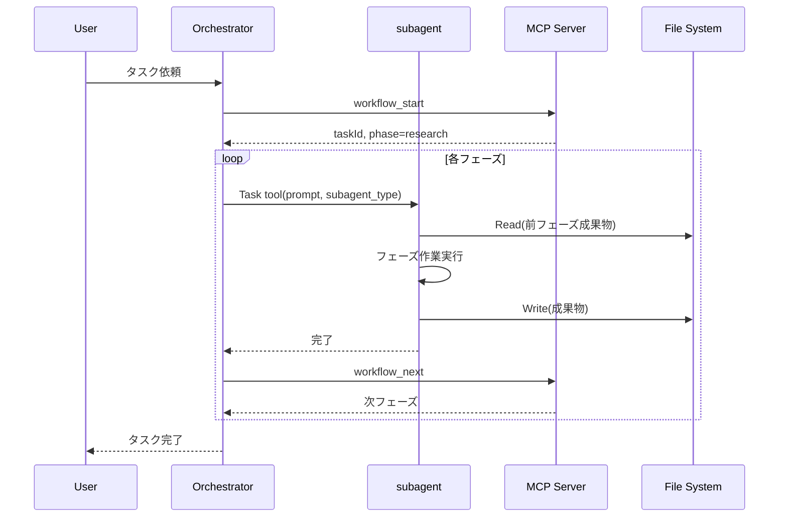

# 仕様書: ワークフローフェーズのsubagent化

## 1. アーキテクチャ概要

### 1.1 Orchestratorパターン

```
┌─────────────────────────────────────────────────────────────┐
│                     Orchestrator (Main Claude)              │
├─────────────────────────────────────────────────────────────┤
│                                                             │
│   1. workflow_startでタスク開始                             │
│   2. フェーズごとにTask toolでsubagentを起動               │
│   3. subagent完了を待機                                     │
│   4. workflow_nextで次フェーズへ                            │
│   5. 並列フェーズは複数Taskを同時起動                       │
│                                                             │
└─────────────────────────────────────────────────────────────┘
                              │
          ┌───────────────────┼───────────────────┐
          ▼                   ▼                   ▼
    ┌──────────┐        ┌──────────┐        ┌──────────┐
    │ subagent │        │ subagent │        │ subagent │
    │ (phase1) │        │ (phase2) │        │ (phase3) │
    └──────────┘        └──────────┘        └──────────┘
          │                   │                   │
          ▼                   ▼                   ▼
    docs/workflows/     docs/workflows/     docs/workflows/
```

### 1.2 実行フロー



---

## 2. CLAUDE.mdの変更仕様

### 2.1 追加セクション

`workflow-plugin/CLAUDE.md`に以下のセクションを追加：

```markdown
## subagentによるフェーズ実行

各ワークフローフェーズはTask toolを使用してsubagentで実行する。

### 実行ルール

1. **フェーズ開始時**: Task toolでsubagentを起動
2. **入力**: 前フェーズの成果物をpromptに含める（ファイルパス指定）
3. **出力**: 成果物を指定パスに保存
4. **完了時**: subagentが返却したらworkflow_nextを呼び出す

### subagent起動テンプレート

[フェーズ名]: [説明]
- subagent_type: [type]
- model: [haiku/sonnet/opus]
- 入力ファイル: [パス]
- 出力ファイル: [パス]
- prompt: [プロンプトテンプレートのパス]
```

### 2.2 フェーズ別設定

| フェーズ | subagent_type | model | 入力 | 出力 |
|---------|---------------|-------|------|------|
| research | Explore | haiku | - | research.md |
| requirements | general-purpose | sonnet | research.md | requirements.md |
| threat_modeling | general-purpose | sonnet | requirements.md | threat-model.md |
| planning | Plan | sonnet | requirements.md | spec.md |
| state_machine | general-purpose | haiku | spec.md | state-machine.mmd |
| flowchart | general-purpose | haiku | spec.md | flowchart.mmd |
| ui_design | general-purpose | sonnet | spec.md | ui-design.md |
| test_design | Plan | sonnet | spec.md, *.mmd | test-design.md |
| test_impl | general-purpose | sonnet | test-design.md | *.test.ts |
| implementation | general-purpose | sonnet | *.test.ts | *.ts |
| refactoring | general-purpose | haiku | *.ts | *.ts |
| build_check | Bash | haiku | - | - |
| code_review | general-purpose | sonnet | *.ts | code-review.md |
| testing | Bash | haiku | - | - |
| manual_test | general-purpose | haiku | - | manual-test.md |
| security_scan | Bash | haiku | - | security-scan.md |
| performance_test | Bash | haiku | - | performance-test.md |
| e2e_test | Bash | haiku | - | e2e-test.md |
| docs_update | general-purpose | haiku | 全成果物 | ドキュメント |
| commit | Bash | haiku | - | - |
| push | Bash | haiku | - | - |

---

## 3. プロンプトテンプレート仕様

### 3.1 ディレクトリ構造

```
skills/workflow/
├── phases/
│   ├── research.md
│   ├── requirements.md
│   ├── threat-modeling.md
│   ├── planning.md
│   ├── state-machine.md
│   ├── flowchart.md
│   ├── ui-design.md
│   ├── test-design.md
│   ├── test-impl.md
│   ├── implementation.md
│   ├── refactoring.md
│   ├── build-check.md
│   ├── code-review.md
│   ├── testing.md
│   ├── manual-test.md
│   ├── security-scan.md
│   ├── performance-test.md
│   ├── e2e-test.md
│   ├── docs-update.md
│   ├── commit.md
│   └── push.md
└── index.md
```

### 3.2 テンプレートフォーマット

各プロンプトテンプレートは以下の構造：

```markdown
# {フェーズ名}フェーズ

## 目的
{フェーズの目的}

## 入力
- 読み込むファイル: `{入力ファイルパス}`

## タスク
1. {タスク1}
2. {タスク2}
...

## 出力
- 出力ファイル: `{出力ファイルパス}`
- フォーマット: {Markdown/Mermaid/etc}

## 品質基準
- {基準1}
- {基準2}

## 完了条件
- {条件1}
- {条件2}
```

---

## 4. 並列実行仕様

### 4.1 parallel_analysisフェーズ

```typescript
// Orchestratorの処理
// 2つのTaskを同時起動
const results = await Promise.all([
  Task({
    prompt: loadTemplate('threat-modeling.md', context),
    subagent_type: 'general-purpose',
    model: 'sonnet',
    description: 'threat modeling'
  }),
  Task({
    prompt: loadTemplate('planning.md', context),
    subagent_type: 'Plan',
    model: 'sonnet',
    description: 'planning'
  })
]);

// 両方完了後
workflow_complete_sub('threat_modeling');
workflow_complete_sub('planning');
workflow_next();
```

### 4.2 parallel_designフェーズ

```typescript
// 3つのTaskを同時起動
const results = await Promise.all([
  Task({ ... , description: 'state machine' }),
  Task({ ... , description: 'flowchart' }),
  Task({ ... , description: 'ui design' })
]);

workflow_complete_sub('state_machine');
workflow_complete_sub('flowchart');
workflow_complete_sub('ui_design');
workflow_next();
```

---

## 5. エラーハンドリング

### 5.1 subagent失敗時

```typescript
try {
  const result = await Task({ ... });
  // 成功処理
} catch (error) {
  // ユーザーに失敗を通知
  console.log(`フェーズ ${phase} が失敗しました: ${error.message}`);
  // 再実行を提案
  const retry = await AskUserQuestion({
    question: '再実行しますか？',
    options: ['はい', 'いいえ']
  });
  if (retry === 'はい') {
    // 同じフェーズを再実行
  }
}
```

### 5.2 成果物検証

```typescript
// フェーズ完了後の検証
const artifactPath = `docs/workflows/${taskName}/${expectedFile}`;
if (!exists(artifactPath)) {
  throw new Error(`成果物が見つかりません: ${artifactPath}`);
}
```

---

## 6. 実装計画

### Phase 1: CLAUDE.md更新
1. subagent実行ルールを追加
2. フェーズ別設定表を追加
3. Orchestratorの動作指示を追加

### Phase 2: プロンプトテンプレート作成
1. skills/workflow/phases/ ディレクトリ作成
2. 各フェーズのテンプレートファイル作成

### Phase 3: 動作検証
1. 単一フェーズのsubagent実行テスト
2. 並列フェーズの同時実行テスト
3. エラーハンドリングテスト

---

## 7. 関連ファイル

<!-- @related-files -->
- `workflow-plugin/CLAUDE.md` - メイン設定ファイル
- `workflow-plugin/skills/workflow/` - プロンプトテンプレート
- `workflow-plugin/mcp-server/src/` - MCPサーバー（変更なし）
<!-- @end-related-files -->
