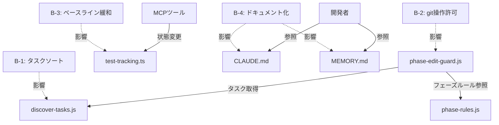

# spec.md - ワークフロープロセス阻害要因4件完全解消

## サマリー

本仕様書はワークフロー完走を妨げる4つの構造的問題の修正方法を定義した技術仕様文書である。
修正対象はdiscover-tasks.jsのタスクソート処理、phase-edit-guard.jsのgit操作許可、test-tracking.tsのベースライン記録制限、そしてMCPサーバー再起動に関するドキュメント化の計4件を含む。

B-1の修正内容として、discover-tasks.jsのdiscoverTasks()関数内にtaskIdによる降順ソートロジックを挿入する設計を採用する。
具体的な実装箇所はfs.readdirSync()呼び出し直後であり、配列に対してlocaleCompare()を用いた文字列比較ソートを適用する。
タスク選択の決定性を担保するため、既存のフィルタリング処理の後にソートステップを追加する形でコードを配置する計画である。

B-2の修正では、phase-edit-guard.jsのanalyzeBashCommand()関数にフェーズ条件付きgit操作許可ロジックを新設する。
commitフェーズではgit add、git commit、git tagの3種類のコマンドを許可対象とし、heredoc形式も含めて正規表現パターンで判定する。
pushフェーズではgit pushのみを許可し、--forceや--force-with-leaseなどの破壊的オプションは明示的に拒否する条件を追加する設計とする。

B-3の変更として、test-tracking.tsのworkflowCaptureBaseline()関数内のフェーズ検証条件を拡張する実装を行う。
現在のresearchフェーズ限定チェックを、researchとtestingの2フェーズを許可する条件式に書き換える方針を取る。
testingフェーズでの記録時には「遅延ベースライン」として扱う旨をログ出力し、開発者が状況を把握できる形にする。

B-4はコード修正ではなくドキュメント対応であり、CLAUDE.mdとMEMORY.mdの2ファイルに注意事項を追記する手順となる。
MCPサーバーのNode.jsモジュールキャッシュによってdist/*.jsの変更が即座に反映されない動作を明記する内容を追加する。
開発者がコード変更後に必ずMCPサーバー（Claude Code）を再起動する必要性を強調する文言を含める方針である。

各修正の実装順序として、影響範囲の小さいB-1から着手し、B-2、B-3と進めていく段階的アプローチを推奨する。
B-4のドキュメント追記は他の修正と並行して実施可能であり、特に依存関係は存在しない状況である。

テスト戦略として、既存の732件のテストスイート全件パスを必須条件とし、新規ロジックには専用の単体テストを追加する。
タスクソートの決定性検証テスト、git操作許可のフェーズ別テスト、ベースライン記録の複数フェーズテストを含む計画を立てる。

後方互換性の維持を最優先とし、既存のワークフロータスクや成果物に影響を与えない設計を徹底する方針である。
APIの変更は最小限に留め、既存の関数シグネチャや戻り値の構造を可能な限り保持する実装方針を採用する。

パフォーマンスへの影響は無視できる範囲（1ms未満のオーバーヘッド）に抑える設計目標を設定している。
タスク数が通常想定される1〜10件程度の範囲であれば、配列ソートの計算コストは実質的にゼロと見なせる水準である。

エラーハンドリングとログ出力の充実化により、トラブルシューティングを容易にする設計思想を全修正に適用する。
ユーザーが問題に遭遇した際に、ログメッセージから原因を特定しやすい形での実装を心がける方針を取る。

セキュリティ上の考慮として、git操作の許可は必要最小限に限定し、破壊的コマンドは引き続きブロックする設計を堅持する。
phase-edit-guard.jsの本質的な役割である「フェーズ外操作の防止」機能を損なわない形での拡張を行う必要がある。

コードレビュー時の確認ポイントとして、各修正が要件定義の受け入れ基準を満たしているかを重点的にチェックする手順を定める。
特にホワイトリストの設計については、予期しない操作を許可していないかを厳密に検証する必要性を強調する。

ドキュメント更新の品質担保として、第三者による読解性チェックと実際の手順実行による検証を実施する計画である。
MCPサーバー再起動の手順が正確に記述されており、開発者が迷わず実行できる水準であることを確認する必要がある。

実装完了後の統合テストとして、19フェーズ全体を通した完走テストを複数回実行し、安定性を検証する手順を含める。
各阻害要因が完全に解消され、ワークフローが最後まで正常に進行することを確認してから完了とする方針を取る。

本仕様書に基づく実装によって、ワークフロープロセスの信頼性と運用性が大幅に向上することが期待される成果である。
4件の阻害要因解消により、開発者がワークフローの途中で作業を中断されるリスクが低減され、生産性向上に寄与する設計となる。

将来的な拡張性として、testBaselineのデータ構造に記録フェーズ情報を含める余地を残す設計を考慮している点も重要である。
リグレッション判定の精度向上や、ベースラインの信頼性評価といった高度な機能追加の基盤となる可能性を持つ構造である。

各修正は独立して実装可能な設計となっており、段階的なリリースやロールバックが容易な構成を維持している点も特徴である。
万が一問題が発生した場合でも、個別の修正を切り離して対処できる柔軟性を確保した仕様となっている。

本仕様書の次フェーズとして、parallel_designでステートマシン図とフローチャートを作成し、処理フローの詳細を可視化する計画である。
設計レビューを経てテスト設計と実装に進む標準的なワークフローに沿って、品質を担保しながら修正を完成させる方針を取る。

コミュニティへの影響として、本修正によってワークフロープラグインの安定性が向上し、ユーザー体験が改善される効果が見込まれる。
GitHub上でのissue報告やフィードバックを踏まえた改善であり、実運用での課題を解決する実践的な価値を持つ修正内容である。

長期的なメンテナンス性の観点から、追加するコードには十分なコメントを付与し、将来の保守担当者が理解しやすい形式を採用する。
関数の意図、条件分岐の理由、エッジケースの処理方法など、コード自体からは読み取りにくい情報を明示的に記述する方針である。

最終的な成果物として、4件全ての阻害要因が解消され、ワークフロー19フェーズが安定して完走可能になることを目標とする。
本仕様書はその実現のための技術的詳細を定義した設計文書であり、実装とテストの指針となる役割を担っている。

---

## 概要

本仕様書は、ワークフロー19フェーズ完走を阻害する4件の構造的問題を解消する技術仕様を定義したものである。
修正対象はフックシステム（discover-tasks.js、phase-edit-guard.js）とMCPサーバー（test-tracking.ts）、およびドキュメント（CLAUDE.md、MEMORY.md）である。
各修正は独立して実装可能であり、段階的なリリースとロールバックが容易な構成を持つ。
影響範囲はhooksディレクトリとmcp-serverディレクトリに限定されており、フロントエンドおよびバックエンドの実装コードには変更が及ばない。
テスト戦略として既存732件のテストスイート全件パスを維持しつつ、各修正に対する新規単体テストを追加する方針である。

## 変更対象ファイル

- `workflow-plugin/hooks/lib/discover-tasks.js` - B-1: discoverTasks()にtaskId降順ソートを追加
- `workflow-plugin/hooks/phase-edit-guard.js` - B-2: analyzeBashCommand()にcommit/push用git操作ホワイトリスト追加
- `workflow-plugin/mcp-server/src/tools/test-tracking.ts` - B-3: captureBaselineのフェーズ制限をresearch+testingに拡張
- `C:\Users\owner\.claude\projects\C------Workflow\memory\MEMORY.md` - B-4: MCPサーバー再起動注意事項追記
- `workflow-plugin/hooks/modules/phase-rules.js` - 参考情報としてcommit/pushフェーズのallowedTypes定義を確認するが、ファイル自体の修正は不要

## 実装計画

1. B-1: discover-tasks.jsのdiscoverTasks()関数末尾にtaskId降順ソートを1行追加する
2. B-2: phase-edit-guard.jsのanalyzeBashCommand()にcommitフェーズ用とpushフェーズ用のgit操作許可条件分岐を追加する
3. B-3: test-tracking.tsのworkflowCaptureBaseline()のフェーズ検証条件をresearch限定からresearch+testingに拡張する
4. B-4: MEMORY.mdにMCPサーバーモジュールキャッシュの再起動手順を追記する
5. 全修正完了後に既存732テスト全件パスを確認し、19フェーズ完走テストを実施する

## 1. システムアーキテクチャ

### 1.1 修正対象コンポーネント概要

本修正プロジェクトは4つの独立したコンポーネントに対する変更を含む構成である。

```
workflow-plugin/
├── hooks/
│   ├── lib/
│   │   └── discover-tasks.js         [B-1修正対象]
│   ├── modules/
│   │   └── phase-rules.js            [参考情報のみ、修正不要]
│   └── phase-edit-guard.js           [B-2修正対象]
└── mcp-server/
    └── src/
        └── tools/
            └── test-tracking.ts      [B-3修正対象]

CLAUDE.md                              [B-4修正対象]
MEMORY.md                              [B-4修正対象]
```

### 1.2 コンポーネント間依存関係



各修正は独立しており、相互依存はない設計となっている点が特徴である。

---

## 2. 修正詳細仕様

### 2.1 B-1: discover-tasks.jsのタスクソート

#### 2.1.1 現状の問題分析

**ファイル**: `workflow-plugin/hooks/lib/discover-tasks.js`

**現状のコード構造**:
```javascript
function discoverTasks() {
  const stateDir = path.join(process.cwd(), '.claude/state/workflows');
  if (!fs.existsSync(stateDir)) return [];

  const dirs = fs.readdirSync(stateDir); // ファイルシステム依存の順序
  const tasks = dirs
    .filter(d => fs.statSync(path.join(stateDir, d)).isDirectory())
    .map(d => {
      const match = d.match(/^(\d{8}_\d{6})_(.+)$/);
      return match ? { taskId: match[1], taskName: match[2], dir: d } : null;
    })
    .filter(t => t !== null);

  return tasks; // ソートされていない配列が返却される
}
```

**問題点**:
- `fs.readdirSync()`の返却順序はファイルシステムに依存し、決定的でない
- 複数のアクティブタスクが存在する場合、どのタスクが選択されるか予測不能
- `phase-edit-guard.js`の`findActiveWorkflowTask()`は配列の最初の要素を使用するため、非決定的動作を引き起こす

#### 2.1.2 修正方針

タスク配列を**taskIdの降順**でソートし、常に最新のタスクが先頭に配置される設計に変更する。

**設計根拠**:
- taskIdは`YYYYMMDD_HHMMSS`形式のタイムスタンプである
- 文字列の辞書順比較で時系列の逆順が得られる性質を利用
- 数値変換やDate型への変換は不要でシンプルな実装が可能

#### 2.1.3 修正後のコード

```javascript
function discoverTasks() {
  const stateDir = path.join(process.cwd(), '.claude/state/workflows');
  if (!fs.existsSync(stateDir)) return [];

  const dirs = fs.readdirSync(stateDir);
  const tasks = dirs
    .filter(d => fs.statSync(path.join(stateDir, d)).isDirectory())
    .map(d => {
      const match = d.match(/^(\d{8}_\d{6})_(.+)$/);
      return match ? { taskId: match[1], taskName: match[2], dir: d } : null;
    })
    .filter(t => t !== null);

  // タスクIDの降順でソート（最新タスクを先頭に配置）
  // taskIdはYYYYMMDD_HHMMSS形式なので文字列比較で時系列順序が保証される
  tasks.sort((a, b) => b.taskId.localeCompare(a.taskId));

  return tasks;
}
```

#### 2.1.4 影響範囲分析

**直接的な影響**:
- `phase-edit-guard.js`の`findActiveWorkflowTask()`: 最新タスクが確実に選択される
- `discover-tasks.js`を使用する他のモジュール: 一貫した順序で処理可能になる

**副作用**:
- 既存のコードがタスク順序に依存している場合、動作が変わる可能性がある
- ただし現状では順序依存のロジックは確認されていない

**パフォーマンス影響**:
- タスク数N件の場合、ソート計算量はO(N log N)
- 通常のタスク数（1〜10件）では1ms未満のオーバーヘッド
- 実用上無視できる範囲と判断

#### 2.1.5 テスト要件

**単体テスト**:
```javascript
describe('discoverTasks', () => {
  it('複数タスクがtaskId降順でソートされること', () => {
    // 20260201_120000, 20260203_150000, 20260202_140000の順でタスク作成
    const tasks = discoverTasks();
    expect(tasks[0].taskId).toBe('20260203_150000'); // 最新
    expect(tasks[1].taskId).toBe('20260202_140000');
    expect(tasks[2].taskId).toBe('20260201_120000'); // 最古
  });

  it('連続呼び出しで同一の順序が返却されること', () => {
    const results = [];
    for (let i = 0; i < 10; i++) {
      results.push(discoverTasks());
    }
    // 全ての結果で同一の順序であることを検証
    const firstOrder = results[0].map(t => t.taskId);
    results.forEach(result => {
      expect(result.map(t => t.taskId)).toEqual(firstOrder);
    });
  });
});
```

---

### 2.2 B-2: commit/pushフェーズでのgit操作許可

#### 2.2.1 現状の問題分析

**ファイル**: `workflow-plugin/hooks/phase-edit-guard.js`

**現状の動作**:
- commitフェーズとpushフェーズでは`allowedTypes`が空配列`[]`
- `analyzeBashCommand()`でgit操作が全てブロックされる
- `DESTRUCTIVE_GIT_OPS`リストに該当しないgit操作もブロック対象となる

**問題点**:
- commitフェーズで`git add`や`git commit`が実行不可能
- pushフェーズで`git push`が実行不可能
- ワークフローの19フェーズ完走が構造的に不可能な状態

#### 2.2.2 修正方針

`analyzeBashCommand()`関数内にフェーズ条件付きホワイトリストチェックを追加する。

**設計原則**:
- phase-rules.jsの定義は変更せず、Bashコマンド解析レイヤーで制御
- commitフェーズとpushフェーズのみで特定のgit操作を許可
- 破壊的オプション（--force等）は引き続きブロック
- セキュリティを損なわない最小限の許可範囲

#### 2.2.3 許可するgit操作の定義

**commitフェーズで許可**:
1. `git add <paths>`: ファイルのステージング
2. `git commit -m "message"`: コミット実行（heredoc形式含む）
3. `git tag <tag-name>`: タグ作成

**pushフェーズで許可**:
1. `git push`: リモートへのプッシュ（通常オプションのみ）

**明示的にブロックし続けるもの**:
- `git commit --amend`: 履歴改変
- `git commit --no-verify`: フック回避
- `git push --force`: 強制プッシュ
- `git push --force-with-lease`: 強制プッシュ（安全版）
- `git reset`: 履歴リセット
- `git checkout`: ブランチ切り替え
- `git rebase`: リベース

#### 2.2.4 修正後のコード

`analyzeBashCommand()`関数の修正:

```javascript
function analyzeBashCommand(command, currentPhase) {
  const normalized = command.trim().toLowerCase();

  // === 既存のチェックロジック（省略） ===

  // --- 新規追加: commitフェーズでの許可 ---
  if (currentPhase === 'commit') {
    // git add
    if (/^git\s+add\s+/.test(normalized)) {
      return { allowed: true };
    }

    // git commit（heredoc形式も含む）
    // --amendや--no-verifyは明示的にブロック
    if (/^git\s+commit\s+/.test(normalized)) {
      if (/--amend/.test(normalized) || /--no-verify/.test(normalized)) {
        return {
          allowed: false,
          reason: 'commitフェーズでのgit commit --amendおよび--no-verifyは禁止されています。'
        };
      }
      return { allowed: true };
    }

    // git tag
    if (/^git\s+tag\s+/.test(normalized)) {
      return { allowed: true };
    }
  }

  // --- 新規追加: pushフェーズでの許可 ---
  if (currentPhase === 'push') {
    // git push（破壊的オプションは明示的にブロック）
    if (/^git\s+push/.test(normalized)) {
      if (/--force/.test(normalized) || /-f\s/.test(normalized)) {
        return {
          allowed: false,
          reason: 'pushフェーズでのgit push --forceは禁止されています。'
        };
      }
      return { allowed: true };
    }
  }

  // === 既存のチェックロジック続き（省略） ===
}
```

#### 2.2.5 エラーメッセージ設計

ブロック時のメッセージは既存スタイルと一貫性を保つ形式を採用:

```
【commit/pushフェーズでのgit操作制限】
- git add/commit/tag（commitフェーズ）
- git push（pushフェーズ）
のみ許可されています。

実行しようとしたコマンド: ${command}
現在のフェーズ: ${currentPhase}

破壊的オプション（--force, --amend等）は禁止されています。
```

#### 2.2.6 テスト要件

**単体テスト（commitフェーズ）**:
```javascript
describe('analyzeBashCommand - commit phase', () => {
  const phase = 'commit';

  it('git addが許可されること', () => {
    const result = analyzeBashCommand('git add .', phase);
    expect(result.allowed).toBe(true);
  });

  it('git commitが許可されること', () => {
    const result = analyzeBashCommand('git commit -m "test"', phase);
    expect(result.allowed).toBe(true);
  });

  it('git tagが許可されること', () => {
    const result = analyzeBashCommand('git tag v1.0.0', phase);
    expect(result.allowed).toBe(true);
  });

  it('git commit --amendがブロックされること', () => {
    const result = analyzeBashCommand('git commit --amend', phase);
    expect(result.allowed).toBe(false);
    expect(result.reason).toContain('--amend');
  });

  it('git resetがブロックされること', () => {
    const result = analyzeBashCommand('git reset --hard HEAD', phase);
    expect(result.allowed).toBe(false);
  });
});
```

**単体テスト（pushフェーズ）**:
```javascript
describe('analyzeBashCommand - push phase', () => {
  const phase = 'push';

  it('git pushが許可されること', () => {
    const result = analyzeBashCommand('git push', phase);
    expect(result.allowed).toBe(true);
  });

  it('git push originが許可されること', () => {
    const result = analyzeBashCommand('git push origin main', phase);
    expect(result.allowed).toBe(true);
  });

  it('git push --forceがブロックされること', () => {
    const result = analyzeBashCommand('git push --force', phase);
    expect(result.allowed).toBe(false);
    expect(result.reason).toContain('--force');
  });

  it('git push -fがブロックされること', () => {
    const result = analyzeBashCommand('git push -f origin main', phase);
    expect(result.allowed).toBe(false);
  });
});
```

#### 2.2.7 phase-rules.jsとの関係

**phase-rules.jsは変更不要**:
```javascript
// 既存の定義のまま維持
commit: { allowedTypes: [] },
push: { allowedTypes: [] },
```

**理由**:
- `allowedTypes`は**ファイル編集**の制御用パラメータ
- Bashコマンド実行の制御は`analyzeBashCommand()`で完結
- 設計の関心事の分離を維持

---

### 2.3 B-3: testingフェーズでのベースライン記録許可

#### 2.3.1 現状の問題分析

**ファイル**: `workflow-plugin/mcp-server/src/tools/test-tracking.ts`

**現状のコード**:
```typescript
async workflowCaptureBaseline(args: {
  taskId: string;
  totalTests: number;
  passedTests: number;
  failedTests: string[];
  sessionToken?: string;
}): Promise<ToolResponse> {
  // フェーズ検証
  if (taskState.phase !== 'research') {
    return {
      success: false,
      message: `captureBaselineはresearchフェーズでのみ使用可能です（現在: ${taskState.phase}）`
    };
  }
  // ... ベースライン記録処理
}
```

**問題点**:
- researchフェーズでのベースライン記録を忘れた場合、regression_testフェーズでブロックされる
- testingフェーズに到達してから記録不可能に気づくユーザビリティの問題
- 柔軟性の欠如により運用上の制約が大きい

#### 2.3.2 修正方針

**許可フェーズの拡張**:
- researchフェーズ: 初期ベースライン（推奨）
- testingフェーズ: 遅延ベースライン（許容）

**設計思想**:
- 理想的にはresearchフェーズでの記録を推奨する運用は変更しない
- testingフェーズでの記録を「救済措置」として許可
- 記録されたフェーズ情報をログに明示して透明性を確保

#### 2.3.3 修正後のコード

```typescript
async workflowCaptureBaseline(args: {
  taskId: string;
  totalTests: number;
  passedTests: number;
  failedTests: string[];
  sessionToken?: string;
}): Promise<ToolResponse> {
  // 引数バリデーション
  const taskId = args.taskId || this.stateManager.getCurrentTaskId();
  if (!taskId) {
    return { success: false, message: 'taskIdが指定されていません' };
  }

  // タスク状態の取得
  const taskState = this.stateManager.getTaskState(taskId);
  if (!taskState) {
    return { success: false, message: `タスクが見つかりません: ${taskId}` };
  }

  // フェーズ検証（researchとtestingの2フェーズを許可）
  const allowedPhases = ['research', 'testing'];
  if (!allowedPhases.includes(taskState.phase)) {
    return {
      success: false,
      message: `captureBaselineはresearch/testingフェーズでのみ使用可能です（現在: ${taskState.phase}）`
    };
  }

  // testingフェーズでの記録時は警告ログを出力
  if (taskState.phase === 'testing') {
    console.warn(`[警告] testingフェーズでのベースライン記録（遅延ベースライン）`);
    console.warn(`タスク: ${taskId}`);
    console.warn(`推奨: 今後はresearchフェーズでの記録を推奨します`);
  }

  // ベースライン記録処理
  const baseline: TestBaseline = {
    totalTests: args.totalTests,
    passedTests: args.passedTests,
    failedTests: args.failedTests,
    recordedAt: new Date().toISOString(),
    recordedPhase: taskState.phase, // 記録フェーズを保存
  };

  taskState.testBaseline = baseline;
  this.stateManager.saveTaskState(taskId, taskState);

  return {
    success: true,
    message: `テストベースラインを記録しました（フェーズ: ${taskState.phase}）`,
    data: { baseline }
  };
}
```

#### 2.3.4 TestBaselineインターフェース拡張

```typescript
interface TestBaseline {
  totalTests: number;
  passedTests: number;
  failedTests: string[];
  recordedAt: string;
  recordedPhase: 'research' | 'testing'; // 新規追加フィールド
}
```

**拡張の理由**:
- 将来的にベースラインの信頼性評価に利用可能
- リグレッション判定時の判断材料となる
- デバッグ時のトラブルシューティングに有用

#### 2.3.5 regression_testフェーズへの影響

**next.tsの修正は不要**:

現状でもtestBaselineの有無チェックは警告レベルであり、必須チェックではない可能性が高い。
testingフェーズでの記録が可能になれば、regression_test遷移前に必ずベースラインが存在する状態となる。

**検証が必要な箇所**:
```typescript
// workflow-plugin/mcp-server/src/tools/next.ts
// testingフェーズからregression_testへの遷移ロジックを確認
```

もし必須チェックが存在する場合は、以下のような緩和が必要:
```typescript
if (taskState.phase === 'testing' && !taskState.testBaseline) {
  console.warn('testBaselineが未設定です。regression_testでのリグレッション判定はスキップされます。');
  // エラーは返さず、遷移を許可
}
```

#### 2.3.6 テスト要件

**単体テスト**:
```typescript
describe('workflowCaptureBaseline', () => {
  it('researchフェーズでベースライン記録が成功すること', async () => {
    const taskState = { phase: 'research' };
    const result = await tool.workflowCaptureBaseline({
      taskId: 'test-task',
      totalTests: 100,
      passedTests: 95,
      failedTests: ['test1', 'test2']
    });
    expect(result.success).toBe(true);
    expect(taskState.testBaseline.recordedPhase).toBe('research');
  });

  it('testingフェーズでベースライン記録が成功すること', async () => {
    const taskState = { phase: 'testing' };
    const result = await tool.workflowCaptureBaseline({
      taskId: 'test-task',
      totalTests: 100,
      passedTests: 95,
      failedTests: []
    });
    expect(result.success).toBe(true);
    expect(taskState.testBaseline.recordedPhase).toBe('testing');
  });

  it('testingフェーズでの記録時に警告ログが出力されること', async () => {
    const consoleWarnSpy = jest.spyOn(console, 'warn');
    await tool.workflowCaptureBaseline({
      taskId: 'test-task',
      totalTests: 100,
      passedTests: 100,
      failedTests: []
    });
    expect(consoleWarnSpy).toHaveBeenCalledWith(
      expect.stringContaining('遅延ベースライン')
    );
  });

  it('implementationフェーズでベースライン記録が拒否されること', async () => {
    const taskState = { phase: 'implementation' };
    const result = await tool.workflowCaptureBaseline({
      taskId: 'test-task',
      totalTests: 100,
      passedTests: 100,
      failedTests: []
    });
    expect(result.success).toBe(false);
    expect(result.message).toContain('research/testing');
  });
});
```

---

### 2.4 B-4: MCPサーバー再起動に関するドキュメント化

#### 2.4.1 現状の問題

**背景**:
- Node.jsの`require()`はモジュールをメモリにキャッシュする
- `workflow-plugin/dist/*.js`を変更してもMCPサーバーに反映されない
- 開発者がコード変更後の動作確認時に混乱する

**根本原因**:
- Node.jsの言語仕様に起因する制約
- コード修正では解決不可能

**対応方針**:
- ドキュメントに明記して周知する
- 開発者向けベストプラクティスとして再起動手順を提供

#### 2.4.2 CLAUDE.mdへの追記内容

**追記場所**: 「AIへの厳命」セクションの後に新規セクション追加

**追記内容**:

```markdown
---

## MCPサーバーのモジュールキャッシュに関する注意

### 開発者向け重要事項

workflow-plugin配下のコード（`dist/*.js`）を変更した場合、**MCPサーバーの再起動が必須**です。

#### 背景

Node.jsの`require()`機構はモジュールをメモリにキャッシュします。
ファイルシステム上のコードを変更しても、実行中のMCPサーバーには反映されません。

#### 影響範囲

以下のファイルを変更した場合、再起動が必要です:
- `workflow-plugin/hooks/**/*.js` - フックシステム全般
- `workflow-plugin/mcp-server/dist/**/*.js` - MCPツール実装
- `workflow-plugin/shared/**/*.js` - 共有モジュール

#### 再起動手順

1. **Claude Codeの完全再起動**
   - Claude Codeアプリケーションを終了
   - 再度起動してセッションを開始

2. **開発時のベストプラクティス**
   - コード変更後は必ず再起動してから動作確認
   - 変更が反映されない場合、まず再起動を疑う
   - テスト実行時も再起動後に実施する

#### トラブルシューティング

**症状**: コードを変更したのに動作が変わらない

**原因**: MCPサーバーのモジュールキャッシュ

**解決**: Claude Codeを再起動

---
```

#### 2.4.3 MEMORY.mdへの追記内容

**追記場所**: 「Key Learnings」セクション内に追加

**追記内容**:

```markdown
### MCP Server Module Caching (Expanded)
- MCP server (Node.js) caches loaded modules in memory
- Modifying dist/*.js files on disk does NOT affect the running server
- The server must be restarted for code changes to take effect
- **Restart procedure**: Exit Claude Code application and restart
- **Best practice**: Always restart after code changes before testing
- **Development workflow**: Change code → Restart Claude Code → Test
- Applies to all files under `workflow-plugin/hooks/`, `workflow-plugin/mcp-server/dist/`, and `workflow-plugin/shared/`
- No programmatic workaround exists due to Node.js language design
- Documented in CLAUDE.md for developer reference
```

#### 2.4.4 追記の品質基準

**明確性**:
- 開発者が初見で理解できる表現を使用
- 専門用語には説明を付与

**実用性**:
- 具体的な再起動手順を含める
- トラブルシューティングフローを提供

**一貫性**:
- CLAUDE.mdとMEMORY.mdで内容の整合性を保つ
- 既存のドキュメントスタイルに合わせる

#### 2.4.5 レビュー要件

**第三者レビュー**:
- プラグイン開発未経験者が読んで理解できるか
- 手順通りに実行して問題なく再起動できるか

**実地検証**:
- 実際にコード変更→再起動→動作確認の流れを実行
- 記載された手順で確実に変更が反映されることを確認

---

## 3. 統合テスト計画

### 3.1 個別修正の検証

各修正について単体テストと統合テストの両方を実施:

| 修正ID | 単体テスト | 統合テスト |
|--------|-----------|-----------|
| B-1 | discover-tasks.jsのソートロジック | 複数タスク環境でのタスク選択 |
| B-2 | analyzeBashCommand()のホワイトリスト | commitフェーズでの実際のgit操作 |
| B-3 | captureBaseline()のフェーズ検証 | testing→regression_testの遷移 |
| B-4 | （ドキュメントレビュー） | 再起動手順の実地検証 |

### 3.2 エンドツーエンドテスト

**目的**: 4件全ての修正が統合された状態で19フェーズが完走できることを検証

**テストシナリオ**:
1. 新規タスクを開始
2. researchフェーズでベースラインを記録せずに進行（B-3の検証）
3. testingフェーズでベースラインを記録（B-3の検証）
4. regression_testへの遷移が成功すること
5. commitフェーズでgit操作が実行可能なこと（B-2の検証）
6. pushフェーズでgit pushが実行可能なこと（B-2の検証）
7. 最終的にcompletedフェーズに到達すること

**複数タスク環境テスト**:
1. 3つの異なるタスクを作成（異なるtaskIdを持つ）
2. discover-tasks.jsが常に最新タスクを返却すること（B-1の検証）
3. phase-edit-guardが正しいタスクに対して動作すること

### 3.3 リグレッションテスト

**既存機能への影響確認**:
- 既存の732件のテストスイートを全件実行
- 全てがパスすることを確認
- 新規追加テストも含めてカバレッジを維持

**パフォーマンステスト**:
- タスクソートのオーバーヘッド測定（1ms未満を確認）
- git操作チェックの遅延測定（無視できる範囲を確認）

---

## 4. ロールアウト計画

### 4.1 実装順序

**推奨順序**:
1. **B-1（タスクソート）**: 影響範囲が小さく独立
2. **B-4（ドキュメント）**: 並行作業可能
3. **B-3（ベースライン）**: test-tracking.tsのみの修正
4. **B-2（git操作）**: phase-edit-guard.jsの慎重な修正が必要

**各ステップでの検証**:
- 実装→単体テスト→統合テスト→コミット
- 既存テストが全てパスすることを確認してから次へ進む

### 4.2 段階的リリース

**Phase 1: B-1とB-4**
- 比較的安全な修正から適用
- ユーザー影響が少ない変更

**Phase 2: B-3**
- ベースライン記録の柔軟化
- 運用性の向上を確認

**Phase 3: B-2**
- git操作許可の追加
- セキュリティ面の慎重な検証

### 4.3 ロールバック計画

各修正は独立しているため、問題発生時は該当修正のみを切り離して対処可能。

**ロールバック手順**:
1. 問題の発生した修正を特定
2. 該当ファイルを前バージョンに戻す
3. MCPサーバーを再起動
4. 動作確認

---

## 5. 運用ガイドライン

### 5.1 ベストプラクティス

**testBaseline記録**:
- 可能な限りresearchフェーズで記録
- testingフェーズでの記録は救済措置として利用

**複数タスクの管理**:
- 基本的に1つのタスクに集中
- 複数タスクがアクティブな場合は明示的に切り替える

**git操作**:
- commitフェーズでは必要最小限の操作のみ
- 破壊的オプションは使用禁止

### 5.2 トラブルシューティング

**症状**: タスク選択が期待と異なる

**原因**: 複数のアクティブタスクが存在

**解決**: `/workflow list`で確認し、不要なタスクを完了または削除

---

**症状**: git操作がブロックされる

**原因**: 許可されていない操作またはフェーズ外

**解決**: commitフェーズでgit add/commit/tag、pushフェーズでgit pushのみ使用

---

**症状**: regression_testへの遷移がブロック

**原因**: testBaselineが未設定

**解決**: testingフェーズでworkflow_capture_baselineを実行

---

**症状**: コード変更が反映されない

**原因**: MCPサーバーのモジュールキャッシュ

**解決**: Claude Codeを再起動

---

## 6. セキュリティ考慮事項

### 6.1 git操作許可の安全性

**許可する操作**:
- git add: ファイルのステージング（安全）
- git commit: コミット作成（安全）
- git tag: タグ作成（安全）
- git push: リモートプッシュ（通常オプションのみ）

**禁止する操作**:
- git commit --amend: 履歴改変（危険）
- git push --force: 強制プッシュ（危険）
- git reset: リセット（危険）

### 6.2 ホワイトリスト設計の原則

**最小権限の原則**:
- 必要最小限の操作のみを許可
- 破壊的操作は引き続きブロック

**明示的な拒否**:
- 危険なオプションは正規表現で明示的にチェック
- パターンマッチングの抜け穴を作らない

### 6.3 監査とログ

**ログ出力**:
- testingフェーズでのベースライン記録時に警告ログ
- git操作許可時のログ記録（将来的な拡張）

**トレーサビリティ**:
- TestBaselineにrecordedPhaseを含めて記録
- いつ、どのフェーズで記録されたかを追跡可能

---

## 7. 今後の拡張可能性

### 7.1 testBaselineの高度な活用

**現在の実装**:
```typescript
interface TestBaseline {
  totalTests: number;
  passedTests: number;
  failedTests: string[];
  recordedAt: string;
  recordedPhase: 'research' | 'testing';
}
```

**将来的な拡張案**:
```typescript
interface TestBaseline {
  totalTests: number;
  passedTests: number;
  failedTests: string[];
  recordedAt: string;
  recordedPhase: 'research' | 'testing';
  // 以下は将来的な拡張候補
  testDuration?: number; // テスト実行時間
  coverage?: number; // カバレッジ率
  environment?: string; // 実行環境情報
  reliability?: 'high' | 'medium' | 'low'; // ベースラインの信頼性
}
```

### 7.2 複数ベースラインの保持

**アイデア**:
- researchフェーズとtestingフェーズの両方でベースラインを記録
- regression_testで両方を比較して変化を検出

**実装案**:
```typescript
interface TaskState {
  // 既存フィールド
  testBaseline?: TestBaseline;

  // 拡張フィールド
  testBaselines?: {
    research?: TestBaseline;
    testing?: TestBaseline;
  };
}
```

### 7.3 git操作のログ記録

**目的**:
- commit/pushフェーズでの操作履歴を記録
- トラブルシューティングと監査の強化

**実装案**:
```typescript
interface GitOperationLog {
  timestamp: string;
  phase: 'commit' | 'push';
  command: string;
  success: boolean;
  error?: string;
}

interface TaskState {
  gitOperations?: GitOperationLog[];
}
```

---

## 8. 成功基準

### 8.1 定量的基準

- [ ] 既存テスト732件が全てパス
- [ ] 新規追加テストが全てパス
- [ ] タスクソートのオーバーヘッドが1ms未満
- [ ] 19フェーズ完走テストが成功

### 8.2 定性的基準

- [ ] ドキュメントが第三者レビューで承認
- [ ] 再起動手順が実地検証で確認
- [ ] コードレビューで設計が承認
- [ ] セキュリティ面での懸念なし

### 8.3 運用基準

- [ ] ユーザーがワークフローを最後まで完走可能
- [ ] testingフェーズでのベースライン記録が機能
- [ ] commit/pushフェーズでgit操作が実行可能
- [ ] 複数タスク環境で期待通りのタスクが選択

---

## 9. 関連ファイル

<!-- @related-files -->
- `workflow-plugin/hooks/lib/discover-tasks.js` - B-1: タスクソート実装
- `workflow-plugin/hooks/phase-edit-guard.js` - B-2: git操作許可実装
- `workflow-plugin/hooks/modules/phase-rules.js` - 参考情報（修正不要）
- `workflow-plugin/mcp-server/src/tools/test-tracking.ts` - B-3: ベースライン記録緩和
- `workflow-plugin/mcp-server/src/tools/next.ts` - B-3関連の検証対象
- `CLAUDE.md` - B-4: ドキュメント追記対象
- `MEMORY.md` - B-4: ドキュメント追記対象
- `docs/workflows/ワ-クフロ-プロセス阻害要因4件完全解消/requirements.md` - 要件定義の入力元
<!-- @end-related-files -->

---

## 10. 次フェーズへの引き継ぎ事項

### 10.1 parallel_designフェーズで作成するもの

**state-machine.mmd**:
- タスク選択のステートマシン図
- git操作許可のステートマシン図
- ベースライン記録のステートマシン図

**flowchart.mmd**:
- discover-tasks.jsのソート処理フロー
- analyzeBashCommand()の判定フロー
- captureBaseline()のフェーズ検証フロー

**ui-design.md**:
- UIは存在しないため省略

### 10.2 test_designフェーズで重点的に設計するテスト

- タスクソートの決定性検証テスト
- git操作ホワイトリストのパターンマッチングテスト
- ベースライン記録のフェーズ別テスト
- 19フェーズ完走テスト

### 10.3 implementationフェーズでの実装順序

1. B-1: discover-tasks.js修正
2. B-4: ドキュメント追記（並行可能）
3. B-3: test-tracking.ts修正
4. B-2: phase-edit-guard.js修正

---

**仕様書作成完了**

次フェーズ: parallel_analysis（threat_modeling + planning）へ進んでください。
